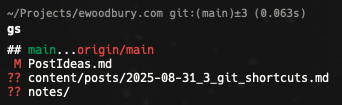
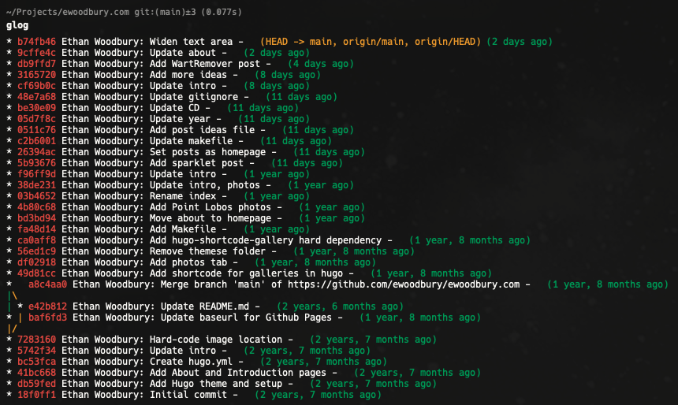
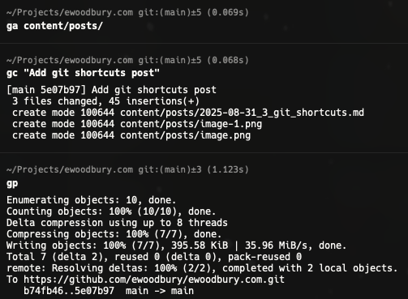

Here are a few simple but useful Git shortcuts that I use dozens of times a day.

TLDR: Add these to your `.bashrc` or `.zshrc`:

```bash
alias g='git'
alias gs='git status -sb'
alias glog="git log --graph --pretty=format:'%Cred%h%Creset %an: %s - %Creset %C(yellow)%d%Creset %Cgreen(%cr)%Creset' --abbrev-commit --date=relative"
alias ga='git add'
alias gc='git commit -m'
alias gp='git push'
```


### 1. `gs`: Status
I prefer this condensed status view over the default.
```bash
gs
```


### 2. `glog`: Log Graph

```bash
glog
```



### 3. `ga/gc/gp`: Add/Commit/Push

```bash
ga content/posts/
gc "Add git shortcuts post"
gp
```


### 4. `g`: Short for `git`

Use for any other git command

```bash
g stash
```


There are many online resources with more comprehensive setups, but the ones below strike the right balance for me. Others that are interesting: 
- [Must-Have Git Aliases](https://www.durdn.com/blog/2012/11/22/must-have-git-aliases-advanced-examples/)
- [Ultimate Git Alias Setup](https://gist.github.com/mwhite/6887990)