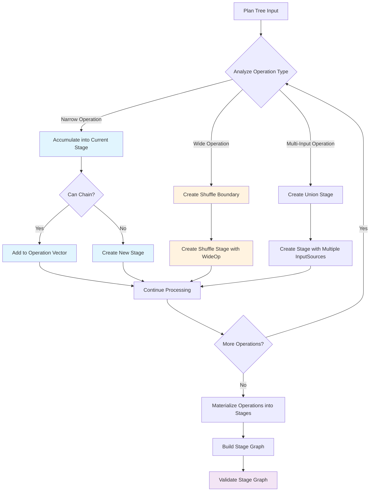

I've been working on rebuilding Apache Spark from scratch in Scala 3 with a project called **Sparklet**. My main goal is to learn more about data processing engine internals and distributed systems, but I'm also eventually hoping to match or even beat Spark's performance with this rebuild. For more background, see my previous post: [Rebuilding Spark with Scala 3](https://ewoodbury.com/posts/2025-07-31_sparklet/).

For an engine like Spark, the Stage Builder component is crucial. It translates the logical plan of operations (what the data engineer wrote) into a physical execution plan (how the cluster will actually run the job). Read on for a brief overview of how Sparklet does this.

### Stage Building Concepts

These concepts closely mirror Apache Spark's architecture.

- Driver: The main program that coordinates the execution of tasks across the cluster.
- Executor: A worker node in the cluster that runs tasks.
- Plan: Logical representation of a data processing job. Does not include execution details.
- Task: A single unit of work that processes a partition of data (e.g. a Map operation or a Filter operation).
- Stage: A group of tasks that can be executed together, without shuffling data.
- Stage Boundary: A point where a stage must end, typically due to a shuffle operation.
- Shuffle: An operation where data is redistributed across the cluster between executors, to prepare for later stages.

The StageBuilder is a single-threaded, local component that runs at the start of a job, which means we fortunately don't need to worry about networking, concurrency, or distribution of logic. The focus here is on correctness and achieving planning optimizations that will be realized later during exeuction. 


### Architecture

Sparklet's StageBuilder follows a simple algorithm:

- Recursively go step-by-step through each Task in a Plan:
    - If the task is a narrow transformation (e.g. Map, Filter), add it to the current Stage (unless it cannot be chained).
    - If the task is a wide transformation (e.g. ReduceByKey, GroupByKey), end the current Stage and start a new one.
    - If the task is a multi-input operation (e.g. Join, Union), ensure that all input Stages are completed, and start a new Stage.

At the end, the newly-built execution dependency graph is validated for correctness (i.e. acyclic, all stages reachable, no out-of-order stages).




### Implementation

#### Key Data Structures
- `StageInfo`: Metadata about a single stage, including its ID, the operations it contains, and its input/output partitioning.
- `InputSource`: One of the following:
  - `SourceInput`: Data source from the start of the job
  - `ShuffleInput`: Input from a shuffle operation
  - `StageOutput`: Output of a previous stage
- `StageGraph`: The final execution plan produced by the StageBuilder. It contains all stages and their dependencies.

#### Chaining Narrow Operations

Of course, we want to keep the final execution graph as simple as possible to reduce overhead, and one of the key ways to do this is keeping the number of stages low.

The StageBuilder attempts to chain together as many narrow operations as possible into a single stage. For example, a sequence of `Map`, `Filter`, and `FlatMap` operations can all be executed in a single stage. We save time by not only skipping any shuffle, but also by eliminating the overhead of additional stages.

```scala
  private[execution] def materialize(ops: Vector[Operation[Any, Any]]): Stage[Any, Any] = {
    require(ops.nonEmpty, "Cannot materialize empty operation vector")
    // For single operations, return the operation directly without chaining
    if (ops.length == 1) {
      ops.headOption match {
        case Some(op) => createStageFromOp(op)
        case None =>
          throw new IllegalStateException(
            "Single operation vector unexpectedly empty after length check. " +
              "This indicates a concurrent modification or internal error.",
          )
      }
    } else {
      // For multiple operations, build the chain efficiently
      ops.headOption match {
        case Some(firstOp) =>
          // subsequent ops are chained via fold onto the stage from the first op:
          ops.drop(1).foldLeft(createStageFromOp(firstOp)) { (stage, op) => 
            chainOperationUnsafe(stage, op)
          }
        case None =>
          throw new IllegalStateException(
            "Multiple operation vector unexpectedly empty after validation. " +
              s"Original vector length: ${ops.length}. " +
              "This indicates a concurrent modification or internal error.",
          )
      }
    }
  }
```


[Link](https://github.com/ewoodbury/sparklet/blob/3dec10e5bb9d58768944416160b78bdc01c03832/modules/sparklet-execution/src/main/scala/com/ewoodbury/sparklet/execution/StageBuilder.scala#L465-L493)


#### Shuffle Detection

Shuffle detection at its core is straightforward. If the next operation in the plan is a wide operation, end the current stage and start a new one.

```scala
  def isDirectlyWide(plan: Plan[_]): Boolean = plan match {
    case _: Plan.GroupByKeyOp[_, _] | _: Plan.ReduceByKeyOp[_, _] | _: Plan.SortByOp[_, _] |
        _: Plan.JoinOp[_, _, _] | _: Plan.CoGroupOp[_, _, _] | _: Plan.RepartitionOp[_] |
        _: Plan.CoalesceOp[_] | _: Plan.PartitionByOp[_, _] =>
      true
    case _ => false
  }
```
[Link](https://github.com/ewoodbury/sparklet/blob/3dec10e5bb9d58768944416160b78bdc01c03832/modules/sparklet-core/src/main/scala/com/ewoodbury/sparklet/core/PlanWide.scala#L61)


#### Shuffle Bypass Optimization

Fortunately for us, not every wide operation needs a shuffle! This is most commonly the case when a Plan has consecutive wide transformations over the same key, such as a `GroupByKey` followed by a `ReduceByKey`. t can also occur when after a series of narrow transformations if the data is still partitioned by the required key.

If you've built massive Spark jobs before, you're well aware of this fact, since you've probably spent many hours ensuring consistent paritioning across your data and/or pipeline to prevent even a single unnecessary shuffle.

Here's the Sparklet code that determines if a shuffle can be bypassed:

<details>
<summary>Click to expand</summary>

```scala
  /**
   * Optimization hook to determine if a shuffle operation can be bypassed based on upstream
   * partitioning metadata. This generalizes the current groupByKey/reduceByKey shortcut.
   */
  private[execution] def canBypassShuffle(
      plan: Plan[_],
      upstreamPartitioning: Option[com.ewoodbury.sparklet.execution.StageBuilder.Partitioning],
      conf: com.ewoodbury.sparklet.core.SparkletConf,
  ): Boolean = {
    plan match {
      case gbk: Plan.GroupByKeyOp[_, _] =>
        // Can bypass if already partitioned by key with correct partition count
        upstreamPartitioning.exists(p =>
          p.byKey && p.numPartitions == conf.defaultShufflePartitions,
        )

      case rbk: Plan.ReduceByKeyOp[_, _] =>
        // Can bypass if already partitioned by key with correct partition count
        upstreamPartitioning.exists(p =>
          p.byKey && p.numPartitions == conf.defaultShufflePartitions,
        )

      case pby: Plan.PartitionByOp[_, _] =>
        /* Can bypass PartitionBy if upstream is already partitioned by key with correct partition
         * count */
        // This enables chaining: partitionBy -> groupByKey to be optimized to a single stage
        upstreamPartitioning.exists(p => p.byKey && p.numPartitions == pby.numPartitions)

      case rep: Plan.RepartitionOp[_] =>
        // Can bypass if already has the desired partitioning
        upstreamPartitioning.exists(p => !p.byKey && p.numPartitions == rep.numPartitions)

      case coal: Plan.CoalesceOp[_] =>
        /* Coalesce always requires shuffle - cannot bypass even if partition count is already
         * correct */
        // because it may need to redistribute data across partitions
        false

      case _ =>
        // Other wide operations cannot bypass shuffle
        false
    }
  }
```
[Link](https://github.com/ewoodbury/sparklet/blob/3dec10e5bb9d58768944416160b78bdc01c03832/modules/sparklet-execution/src/main/scala/com/ewoodbury/sparklet/execution/Operation.scala#L138-L176)
</details>
<br/>

Once the StageBuilder knows a shuffle can be bypassed, it implements the optimization by simply not creating a new stage. The wide transformation is added to the current stage instead.
```scala
// within StageBuilder.buildStagesFromPlan:
  private def buildStagesFromPlan[A](
      ctx: BuildContext,
      plan: Plan[A],
      builderMap: mutable.Map[StageId, StageDraft],
      dependencies: mutable.Map[StageId, mutable.Set[StageId]],
  ): (StageId, Option[Plan[_]]) = {
    ...
    if (Operation.canBypassShuffle(groupByKey, src.outputPartitioning, SparkletConf.get)) {
        // Add local groupByKey operation to existing stage since shuffle can be bypassed
        val resultId = appendOperation(
        ctx,
        sourceStageId,
        GroupByKeyLocalOp[Any, Any]().asInstanceOf[Operation[Any, Any]],
        builderMap,
        dependencies,
        )
        (resultId, Some(groupByKey))
    }
    ...
```
[Link](https://github.com/ewoodbury/sparklet/blob/3dec10e5bb9d58768944416160b78bdc01c03832/modules/sparklet-execution/src/main/scala/com/ewoodbury/sparklet/execution/StageBuilder.scala#L847-L856)


#### Creating a Shuffle Boundary

If Sparklet has determined that a shuffle is unavoidable, it creates a shuffle boundary when processing that operation as follows:

- Function calls `createShuffleStageUnified`, which:
  - Validates that all input stages are complete
  - Creates a new `StageDraft` object corresponding to the operation type (e.g. `GroupByKeyWideOp`)
  - Sets up `ShuffleInput` sources for the new stage, pointing to the output of the input stages
  - Updates the dependency graph to reflect the new stage and its inputs
  - Returns the new stage ID
- Main function then appends the shuffle stage ID, then the new operation to the current plan as a new stage.

<details>
<summary>Click to expand code</summary>

```scala
    // Within StageBuilder.buildStagesFromPlan:
      // Wide transformations (create shuffle boundaries)
      case groupByKey: Plan.GroupByKeyOp[_, _] =>
        val (sourceStageId, _) =
          buildStagesFromPlan(ctx, groupByKey.source, builderMap, dependencies)
        val src = builderMap(sourceStageId)
        val defaultN = SparkletConf.get.defaultShufflePartitions

        if (Operation.canBypassShuffle(groupByKey, src.outputPartitioning, SparkletConf.get)) {
            ... // Shuffle is bypassed in this case.
        } else {
          val shuffleId = createShuffleStageUnified(
            ctx,
            Seq(sourceStageId),
            GroupByKeyWideOp(
              SimpleWideOpMeta(
                kind = WideOpKind.GroupByKey,
                numPartitions = defaultN,
              ),
            ),
            builderMap,
            dependencies,
            Some(groupByKey),
          )
          (shuffleId, Some(groupByKey))
        }

    // Within StageBuilder.createShuffleStageUnified:
        // Create shuffle input sources based on operation type
    val shuffleInputSources = meta.kind match {
      case WideOpKind.Join | WideOpKind.CoGroup =>
        // Skip multi-stage operations for brevity here
      case _ =>
        // Single-input operations
        require(upstreamIds.length == 1, s"${meta.kind} requires exactly 1 upstream stage")
        upstreamIds.headOption match {
          // Create ShuffleInput from the latest upstream stage:
          case Some(upstreamId) => Seq(ShuffleInput(upstreamId, None, meta.numPartitions))
          case None =>
            throw new IllegalStateException(
              s"${meta.kind} operation missing required upstream stage",
            )
        }
    }
    ...
    // Add dependencies for all upstream stages
    upstreamIds.foreach { upstreamId =>
      addDependency(dependencies, shuffleStageId, upstreamId)
    }

    // Return the new Shuffle stage ID:
    shuffleStageId
```
[Link](https://github.com/ewoodbury/sparklet/blob/3dec10e5bb9d58768944416160b78bdc01c03832/modules/sparklet-execution/src/main/scala/com/ewoodbury/sparklet/execution/StageBuilder.scala#L841)

</details>


### Validation 

The final main step is the validation of the generated graph. We run the following checks:
- Acyclic: Ensure there are no cycles in the stage dependency graph.
- Reachability: Ensure all stages are reachable from the initial data sources.
- Order: Ensure that no stage depends on a future stage (i.e. all dependencies are valid).
- Shuffle invariants: shuffle stages must not have empty shuffle metadata, shuffle stages must have empty transformation metadata, multi-input stages must have multiple input sources.
- Partitioning invariants: `byKey` partition must only exist on keyed operations (groupByKey, reduceByKey, join, etc.)

<details>
<summary>Click to expand code</summary>

```scala
  /**
   * Validates that the stage graph is acyclic using depth-first search.
   */
  private def validateAcyclicity(graph: StageGraph): Unit = {
    val visiting = mutable.Set[StageId]()
    val visited = mutable.Set[StageId]()

    def dfsVisit(stageId: StageId): Unit = {
      if (visiting.contains(stageId)) {
        val cyclePath = visiting.toSeq :+ stageId
        throw new IllegalStateException(
          s"Cycle detected in stage graph involving stage $stageId. " +
            s"Cycle path: ${cyclePath.mkString(" -> ")}. " +
            "This indicates a circular dependency that would prevent execution.",
        )
      }
      if (visited.contains(stageId)) {
        return
      }

      visiting.add(stageId)
      graph.dependencies.getOrElse(stageId, Set.empty).foreach(dfsVisit)
      visiting.remove(stageId)
      visited.add(stageId)
    }

    graph.stages.keys.foreach { stageId =>
      if (!visited.contains(stageId)) {
        dfsVisit(stageId)
      }
    }
  }

  /**
   * Validates that all stages are reachable from the final stage via reverse traversal.
   */
  private def validateReachability(graph: StageGraph): Unit = {
    val reachable = mutable.Set[StageId]()
    val toVisit = mutable.Queue[StageId]()

    // Start from finalStageId and traverse backwards through dependencies
    toVisit.enqueue(graph.finalStageId)
    reachable.add(graph.finalStageId)

    while (toVisit.nonEmpty) {
      val current = toVisit.dequeue()
      graph.dependencies.getOrElse(current, Set.empty).foreach { depId =>
        if (!reachable.contains(depId)) {
          reachable.add(depId)
          toVisit.enqueue(depId)
        }
      }
    }

    // Check for orphaned stages
    val allStageIds = graph.stages.keySet
    val orphaned = allStageIds -- reachable
    if (orphaned.nonEmpty) {
      val reachableStages = reachable.toSeq.sorted.mkString(", ")
      throw new IllegalStateException(
        s"Orphaned stages not reachable from finalStageId ${graph.finalStageId}: [${orphaned.toSeq.sorted.mkString(", ")}]. " +
          s"Reachable stages: [$reachableStages]. " +
          "Check for disconnected stage subgraphs or missing dependencies.",
      )
    }
  }

  /**
   * Validates that stage IDs form a monotonic sequence (strictly increasing from 0).
   */
  private def validateStageIdMonotonicity(graph: StageGraph): Unit = {
    val stageIds = graph.stages.keys.toSeq.sorted
    if (stageIds.nonEmpty) {
      // Check starts from 0
      stageIds.headOption match {
        case Some(firstId) if firstId.toInt != 0 =>
          throw new IllegalStateException(
            s"Stage IDs should start from 0, but found minimum ID: ${firstId.toInt}",
          )
        case None =>
          // This case shouldn't happen since we check nonEmpty above, but handle defensively
          throw new IllegalStateException("Stage ID sequence is unexpectedly empty")
        case Some(_) => // firstId.toInt == 0, which is correct
      }

      // Check for gaps (warn only to future-proof ID reuse scenarios)
      val expectedSequence = (0 until stageIds.length).map(StageId(_))
      val actualSet = stageIds.toSet
      val missing = expectedSequence.filterNot(actualSet.contains)
      if (missing.nonEmpty) {
        // Use println instead of logging to avoid dependencies
        println(
          s"Warning: Stage ID sequence has gaps. Missing IDs: ${missing.map(_.toInt).mkString(", ")}",
        )
      }
    }
  }

  /**
   * Validates shuffle stage specific invariants.
   */
  private def validateShuffleStages(graph: StageGraph): Unit = {
    graph.stages.values.foreach { stageInfo =>
      if (stageInfo.isShuffleStage) {
        // Shuffle stages should have shuffle operation metadata
        if (stageInfo.shuffleOperation.isEmpty) {
          throw new IllegalStateException(
            s"Shuffle stage ${stageInfo.id} has no shuffle operation metadata",
          )
        }

        // Shuffle stages should have empty ops vector (they don't execute operations)
        stageInfo.stage match {
          case _: Stage.ChainedStage[_, _, _] =>
            // ChainedStage should not be used for shuffle stages
            throw new IllegalStateException(
              s"Shuffle stage ${stageInfo.id} incorrectly uses ChainedStage",
            )
          case _ => // Other stage types are acceptable for shuffle stages
        }

        // Multi-input shuffle stages should have proper side markers
        if (stageInfo.inputSources.length == 2) {
          val shuffleInputs = stageInfo.inputSources.collect { case si: ShuffleInput => si }
          if (shuffleInputs.length != 2) {
            throw new IllegalStateException(
              s"Multi-input shuffle stage ${stageInfo.id} should have exactly 2 ShuffleInputs, found ${shuffleInputs.length}",
            )
          }
          if (shuffleInputs.exists(_.side.isEmpty)) {
            throw new IllegalStateException(
              s"Multi-input shuffle stage ${stageInfo.id} has ShuffleInputs without side markers",
            )
          }
          val sides = shuffleInputs.flatMap(_.side).toSet
          if (sides.size != 2 || !sides.contains(Side.Left) || !sides.contains(Side.Right)) {
            throw new IllegalStateException(
              s"Multi-input shuffle stage ${stageInfo.id} has invalid side markers: expected {Left, Right}, found $sides",
            )
          }

          // Validate numPartitions consistency across inputs
          val numPartitionsList = shuffleInputs.map(_.numPartitions).distinct
          if (numPartitionsList.length > 1) {
            throw new IllegalStateException(
              s"Multi-input shuffle stage ${stageInfo.id} has mismatched numPartitions across inputs: ${numPartitionsList.mkString(", ")}",
            )
          }
        }
      }
    }
  }

  /**
   * Validates partitioning invariants - byKey should only be true for operations that guarantee
   * key grouping.
   */
  private def validatePartitioningInvariants(graph: StageGraph): Unit = {
    /* Operations that guarantee key grouping - simplified approach since classOf with generics is
     * problematic */
    // In practice, this would be implemented with a more sophisticated operation analysis system

    graph.stages.values.foreach { stageInfo =>
      stageInfo.outputPartitioning.foreach { partitioning =>
        if (partitioning.byKey) {
          // For byKey=true, verify stage has key-grouping operations or is a shuffle stage
          if (!stageInfo.isShuffleStage) {
            stageInfo.stage match {
              case _: Stage.ChainedStage[_, _, _] =>
              // For chained stages, check if any operation guarantees key grouping
              /* Note: This is a simplified check - in practice we'd need to analyze the operation
               * chain */
              // For now, we'll be permissive and allow byKey=true if it's explicitly set
              /* This validation can be strengthened in the future with more detailed operation
               * analysis */
              case _ =>
              // For single operation stages, we could check the specific operation type
              // But since we don't have direct access to the operation, we'll be permissive here
            }
          }
        }
      }
    }
  }
```
[Link](https://github.com/ewoodbury/sparklet/blob/3dec10e5bb9d58768944416160b78bdc01c03832/modules/sparklet-execution/src/main/scala/com/ewoodbury/sparklet/execution/StageBuilder.scala#L261)
</details>

<br/>
If all of these checks pass, the StageBuilder was successful! It returns a final `StageGraph` object that is passed to the Sparklet engine for execution.

---
Thanks for reading! I plan to do more deep dives into the Sparklet internals over time. Feel free to follow along on the [GitHub repo](https://github.com/ewoodbury/sparklet) for updates in real-time. Until next time!