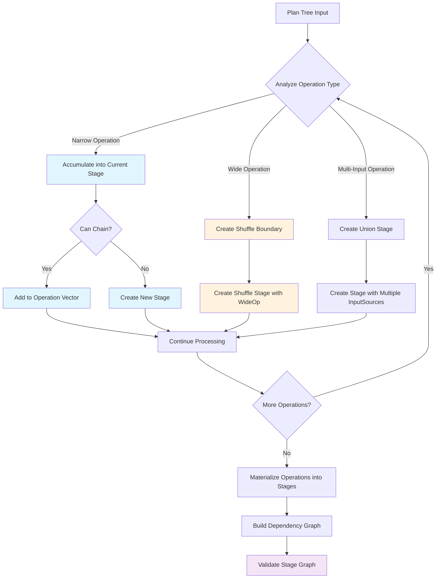

This document outlines the design of Sparklet's `StageBuilder`


### Concepts

These concepts closely mirror Apache Spark's architecture.

- Driver: The main program that coordinates the execution of tasks across the cluster.
- Executor: A worker node in the cluster that runs tasks.
- Plan: Logical representation of a data processing job. Does not include execution details.
- Task: A single unit of work that processes a partition of data (e.g. a Map operation or a Filter operation).
- Stage: A group of tasks that can be executed together, without shuffling data.
- Stage Boundary: A point where a stage must end, typically due to a shuffle operation.
- Shuffle: An operation where data is redistributed across the cluster between executors, to prepare for later stages.
- DAG (Directed Acyclic Graph): A full representation of the sequence of stages and their dependencies.

### Architecture

At its core, Sparklet's StageBuilder follows a relatively simple algorithm:

- Recursively go step-by-step through each Task in a Plan:
    - If the task is a narrow transformation (e.g. Map, Filter), add it to the current Stage (unless it cannot be chained).
    - If the task is a wide transformation (e.g. ReduceByKey, GroupByKey), end the current Stage and start a new one.
    - If the task is a multi-input operation (e.g. Join, Union), ensure that all input Stages are completed, and start a new Stage.




### Implementation Details

#### Key Data Structures
- `StageInfo`: Metadata about a single stage, including its ID, the operations it contains, and its input/output partitioning.
- `InputSource`: One of the following:
  - `SourceInput`: Data source from the start of the job
  - `ShuffleInput`: Input from a shuffle operation
  - `StageOutput`: Output of a previous stage
- `StageGraph`: The final execution plan produced by the StageBuilder. It contains all stages and their dependencies.

#### Topological Sorting

#### Chaining Narrow Operations

#### Shuffle Detection


#### Shuffle Bypass Optimization

A key optimization that the StageBuilder should implement is shuffle bypassing. When a wide transformation can be executed without a shuffle, the StageBuilder should recognize this and avoid creating an unnecessary shuffle stage. This is most commonly the case when a Plan has consecutive wide transformations over the same key, such as a `GroupByKey` followed by a `ReduceByKey`, but it can also occur when after a series of narrow transformations if the data is still partitioned by the required key.

Here's the Sparklet code that determines if a shuffle can be bypassed:

<details>
<summary>Click to expand</summary>

```scala
  /**
   * Optimization hook to determine if a shuffle operation can be bypassed based on upstream
   * partitioning metadata. This generalizes the current groupByKey/reduceByKey shortcut.
   */
  private[execution] def canBypassShuffle(
      plan: Plan[_],
      upstreamPartitioning: Option[com.ewoodbury.sparklet.execution.StageBuilder.Partitioning],
      conf: com.ewoodbury.sparklet.core.SparkletConf,
  ): Boolean = {
    plan match {
      case gbk: Plan.GroupByKeyOp[_, _] =>
        // Can bypass if already partitioned by key with correct partition count
        upstreamPartitioning.exists(p =>
          p.byKey && p.numPartitions == conf.defaultShufflePartitions,
        )

      case rbk: Plan.ReduceByKeyOp[_, _] =>
        // Can bypass if already partitioned by key with correct partition count
        upstreamPartitioning.exists(p =>
          p.byKey && p.numPartitions == conf.defaultShufflePartitions,
        )

      case pby: Plan.PartitionByOp[_, _] =>
        /* Can bypass PartitionBy if upstream is already partitioned by key with correct partition
         * count */
        // This enables chaining: partitionBy -> groupByKey to be optimized to a single stage
        upstreamPartitioning.exists(p => p.byKey && p.numPartitions == pby.numPartitions)

      case rep: Plan.RepartitionOp[_] =>
        // Can bypass if already has the desired partitioning
        upstreamPartitioning.exists(p => !p.byKey && p.numPartitions == rep.numPartitions)

      case coal: Plan.CoalesceOp[_] =>
        /* Coalesce always requires shuffle - cannot bypass even if partition count is already
         * correct */
        // because it may need to redistribute data across partitions
        false

      case _ =>
        // Other wide operations cannot bypass shuffle
        false
    }
  }
```
[Link](https://github.com/ewoodbury/sparklet/blob/3dec10e5bb9d58768944416160b78bdc01c03832/modules/sparklet-execution/src/main/scala/com/ewoodbury/sparklet/execution/Operation.scala#L138-L176)
</details>
<br/>

Once the StageBuilder knows a shuffle can be bypassed, it implements the optimization by simply not creating a new stage. The wide transformation is added to the current stage instead.
```scala
// within StageBuilder.buildStagesFromPlan:
  private def buildStagesFromPlan[A](
      ctx: BuildContext,
      plan: Plan[A],
      builderMap: mutable.Map[StageId, StageDraft],
      dependencies: mutable.Map[StageId, mutable.Set[StageId]],
  ): (StageId, Option[Plan[_]]) = {
    ...
    if (Operation.canBypassShuffle(groupByKey, src.outputPartitioning, SparkletConf.get)) {
        // Add local groupByKey operation to existing stage since shuffle can be bypassed
        val resultId = appendOperation(
        ctx,
        sourceStageId,
        GroupByKeyLocalOp[Any, Any]().asInstanceOf[Operation[Any, Any]],
        builderMap,
        dependencies,
        )
        (resultId, Some(groupByKey))
    }
    ...
```
[Link](https://github.com/ewoodbury/sparklet/blob/3dec10e5bb9d58768944416160b78bdc01c03832/modules/sparklet-execution/src/main/scala/com/ewoodbury/sparklet/execution/StageBuilder.scala#L847-L856)


## Future Work