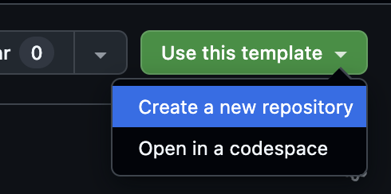

New software projects can be tricky to set up, especially if it's for an unfamiliar language or framework. Early on, a few poor decisions can cause issues that stick around for years. 

When I started a new Spark project with Scala at work, it took me a couple of weeks to get the build system, test framework, and core data pipeline structure set up in a way I was happy with.

I think there's tremendous value in sharing project templates which have best practices baked in. I think this is especially helpful for Spark and Scala because:
  - Spark is complex, and it's not clear how to go from Jupyter notebooks (where many Spark developers start) to a full, production-ready job.
  - Scala is lacks the "Getting Started" resources that exist for data engineering in Python. We as a community should do a better job of building an easy on-ramp for folks new to this domain.
  - Testing remains sorely neglected in data engineering. It's hugely beneficial to have a test framework running from the get-go. Spark also makes it even easier to test compared to other databases, since you can run everything on your machine in local mode.

## Why Scala?

For Spark projects, I believe Scala has two main advantages over PySpark:
  1. Type Safety: With the Scala API for Spark, you have `DataSet` objects, which let you specify the columns in every table throughout the job. This lets you keep track of the fields in complex jobs at each transformation step, compared to they typical PySpark/pandas style of lacking dataframe information until runtime. Besides this, Scala's status as a compiled language catches many other common mistakes immediately, without requiring a slow build and deploy cycle to test.
  2. Functional Programming by default: This aspect is more subtle, but pays off in the long run. Scala encourages immutability of data structures and pure functions. There are even common Scala utilities (like [WartRemover](https://www.wartremover.org/)) that help enforce this. Functional programming leads to code that is easier to reason about, test, and maintain. Of course, this is possible in Python as well, but Scala makes this the default style.

Note that performance is not included here, despite being a common justification. All Spark code is transpiled to Spark operations, so PySpark versus Scala job definitions usually have identical performance. There are some small benefits with UDFs in Scala, but that's less common (and might indicate you're doing something wrong).

I plan to write a longer post on Scala for data engineering in the future!

Below, I share a Spark project template with Scala 2.13 that from what I've learned running massive Spark pipelines in production. The template is available on [GitHub](https://github.com/ewoodbury/spark-template-scala-2.13).

---

## Contents

1. [Quickstart Guide](#1-quickstart-guide)
2. [Project Components](#2-project-components)
    - [i. Project Setup](#i-project-setup)
    - [ii. Core Pipeline Code](#ii-core-pipeline-code)
    - [iii. Spark Toolbox](#iii-spark-toolbox)
    - [iv. Test Framework](#iv-test-framework)
    - [v. Developer Experience and CI (Scalafmt, Scalafix, Github Actions)](#iv-developer-experience-and-ci-scalafmt-scalafix-github-actions)
3. [File Structure Overview](#3-file-structure-overview)
4. [Principles and Best Practices](#4-principles-and-best-practices)

## 1. Quickstart Guide

1. Create a copy of the template repository using the "Use this template" button on GitHub. 

      

2. Clone your new repository, and open it on your machine.

3. Make sure you the required software installed:
   - Java 17 (recommend [jenv](https://www.jenv.be/) for managing multiple Java versions)
   - [Scala 2.13.x](https://www.scala-lang.org/download/)
   - [sbt](https://www.scala-sbt.org/download.html)

4. Run `sbt compile` to download dependencies and compile the project. If it succeeds, everything is working!

5. Run `sbt test` to run the tests. You should see all tests pass.

6. When you're ready to build a JAR for deployment, run `sbt assembly`. This will create a fat JAR in `target/scala-2.13/` that you can submit to your Spark cluster using `spark-submit`.

If all goes well, you're ready to start writing your own Spark code! Read on for a tour of the project structure and components.

## 2. Project Components

### i. Project Setup

We use [sbt](https://www.scala-sbt.org/) as our build tool, which is the de facto standard for Scala. The `build.sbt` file specifies our Scala version, dependencies, and other other project settings.

We start with the basic project settings, including the Scala version and organization name.

```scala
ThisBuild / organization := "com.example"
ThisBuild / version := "0.1.0-SNAPSHOT"
ThisBuild / scalaVersion := "2.13.12"
```

When managing Spark dependencies, you don't need to bundle in the core Spark libraries with your application. These dependencies are already included in all common Spark deployments. Mark these dependencies as `Provided` to reduce your compiled JAR size and avoid version conflicts. We specify our Iceberg (or other table format) dependencies as `Provided` as well.

However, we do include Spark dependencies in the `Compile` scope for local development and testing.

```scala
    libraryDependencies ++= Seq(
      "org.apache.spark" %% "spark-core" % "3.5.1" % "provided",
      "org.apache.spark" %% "spark-sql" % "3.5.1" % "provided",
      "org.apache.iceberg" % "iceberg-spark-runtime-3.5_2.13" % "1.4.2" % "provided",
      
      // Development dependencies (for local running)
      "org.apache.spark" %% "spark-core" % "3.5.1" % Compile,
      "org.apache.spark" %% "spark-sql" % "3.5.1" % Compile,

      // CLI Parsing
      "com.github.scopt" %% "scopt" % "4.1.0",
    )
```

We specify our test dependencies with `Test` scope to prevent them from being included in our production JAR as well. This also includes core Spark libraries, as well as the popular `spark-testing-base` library.

```scala
    libraryDependencies ++= Seq(
      "org.scalatest" %% "scalatest" % "3.2.17" % Test,
      "org.apache.spark" %% "spark-core" % "3.5.1" % Test,
      "org.apache.spark" %% "spark-sql" % "3.5.1" % Test,
      "com.holdenkarau" %% "spark-testing-base" % "3.5.0_1.4.7" % Test
    )
```

<details>
<summary>Expand to view full build.sbt</summary>

```scala
ThisBuild / organization := "com.example"
ThisBuild / version := "0.1.0-SNAPSHOT"
ThisBuild / scalaVersion := "2.13.12"

// Scalafix settings
ThisBuild / semanticdbEnabled := true
ThisBuild / semanticdbVersion := scalafixSemanticdb.revision

lazy val root = (project in file("."))
  .settings(
    name := "scala-spark-template-213",
    
    // Scala 2.13 settings
    scalacOptions ++= Seq(
      "-deprecation",
      "-feature",
      "-unchecked",
      "-Xfatal-warnings",
      "-language:higherKinds",
      "-Wunused:imports,privates,locals,explicits,implicits,params",
      "-Xlint:_",
      "-Ywarn-dead-code",
      "-Ywarn-numeric-widen",
      "-Ywarn-value-discard"
    ),
    
    // Spark dependencies (provided to reduce jar size)
    libraryDependencies ++= Seq(
      "org.apache.spark" %% "spark-core" % "3.5.1" % "provided",
      "org.apache.spark" %% "spark-sql" % "3.5.1" % "provided",
      
      // Development dependencies (for local running)
      "org.apache.spark" %% "spark-core" % "3.5.1" % Compile,
      "org.apache.spark" %% "spark-sql" % "3.5.1" % Compile,
      
      // CLI argument parsing
      "com.github.scopt" %% "scopt" % "4.1.0",
      
      // Iceberg support (production)
      "org.apache.iceberg" % "iceberg-spark-runtime-3.5_2.13" % "1.4.2" % "provided",
      
      // Test dependencies (include Spark for testing)
      "org.scalatest" %% "scalatest" % "3.2.17" % Test,
      "org.apache.spark" %% "spark-core" % "3.5.1" % Test,
      "org.apache.spark" %% "spark-sql" % "3.5.1" % Test,
      "com.holdenkarau" %% "spark-testing-base" % "3.5.0_1.4.7" % Test
    ),
    
    // Assembly settings for fat jar creation
    assembly / assemblyMergeStrategy := {
      case PathList("META-INF", xs @ _*) => MergeStrategy.discard
      case x => MergeStrategy.first
    },
    
    // Assembly jar name
    assembly / assemblyJarName := s"${name.value}-${version.value}.jar",
    
    // Exclude provided dependencies from assembly
    assembly / assemblyExcludedJars := {
      val cp = (assembly / fullClasspath).value
      cp filter { jar =>
        jar.data.getName.contains("spark-")
      }
    },
    
    Test / parallelExecution := true,
    Test / fork := true,
    // Enable multiple JVMs for better isolation and parallel execution
    Test / testForkedParallel := true,
    // Limit concurrent tests to avoid resource exhaustion  
    Test / testOptions += Tests.Argument(TestFrameworks.ScalaTest, "-P4"),
    Test / javaOptions ++= Seq(
      "-Xmx3g", // Increased memory for parallel execution
      "-XX:+UseG1GC", // Better GC for concurrent workloads
      "-XX:MaxGCPauseMillis=200",
      "--add-opens=java.base/java.lang=ALL-UNNAMED",
      "--add-opens=java.base/java.lang.invoke=ALL-UNNAMED",
      "--add-opens=java.base/java.lang.reflect=ALL-UNNAMED",
      "--add-opens=java.base/java.io=ALL-UNNAMED",
      "--add-opens=java.base/java.net=ALL-UNNAMED",
      "--add-opens=java.base/java.nio=ALL-UNNAMED",
      "--add-opens=java.base/java.util=ALL-UNNAMED",
      "--add-opens=java.base/java.util.concurrent=ALL-UNNAMED",
      "--add-opens=java.base/java.util.concurrent.atomic=ALL-UNNAMED",
      "--add-opens=java.base/sun.nio.ch=ALL-UNNAMED",
      "--add-opens=java.base/sun.nio.cs=ALL-UNNAMED",
      "--add-opens=java.base/sun.security.action=ALL-UNNAMED",
      "--add-opens=java.base/sun.util.calendar=ALL-UNNAMED",
      "--add-opens=java.security.jgss/sun.security.krb5=ALL-UNNAMED",
      "--add-opens=java.base/javax.security.auth=ALL-UNNAMED",
      "--add-opens=java.base/sun.security.util=ALL-UNNAMED"
    ),
    
    // Runtime JVM options
    run / javaOptions ++= Seq(
      "-Xmx2g",
      "--add-opens=java.base/java.lang=ALL-UNNAMED",
      "--add-opens=java.base/java.lang.invoke=ALL-UNNAMED",
      "--add-opens=java.base/java.lang.reflect=ALL-UNNAMED",
      "--add-opens=java.base/java.io=ALL-UNNAMED",
      "--add-opens=java.base/java.net=ALL-UNNAMED",
      "--add-opens=java.base/java.nio=ALL-UNNAMED",
      "--add-opens=java.base/java.util=ALL-UNNAMED",
      "--add-opens=java.base/java.util.concurrent=ALL-UNNAMED",
      "--add-opens=java.base/java.util.concurrent.atomic=ALL-UNNAMED",
      "--add-opens=java.base/sun.nio.ch=ALL-UNNAMED",
      "--add-opens=java.base/sun.nio.cs=ALL-UNNAMED",
      "--add-opens=java.base/sun.security.action=ALL-UNNAMED",
      "--add-opens=java.base/sun.util.calendar=ALL-UNNAMED",
      "--add-opens=java.security.jgss/sun.security.krb5=ALL-UNNAMED",
      "--add-opens=java.base/javax.security.auth=ALL-UNNAMED",
      "--add-opens=java.base/sun.security.util=ALL-UNNAMED"
    ),
    
    run / fork := true
  )
```
</details>

### ii. Core Pipeline Code
The core pipeline code is located in `src/main/scala/com/example/useractivity/`. It is divided into three levels, each with a different testing strategy:
  - `App.scala`: The application entrypoint, which handles argument parsing and job orchestration. This is not tested, as it is a thin wrapper to start the job that depends on the Spark environment.
  - `UserActivity.scala`: The core ETL job logic, which defines the data transformations and business logic. This is covered by end-to-end tests.
  - `UserActivityTransformations.scala`: Pure transformation functions, which are all extensively unit tested.

### iii. Spark Toolbox
The Spark Toolbox is located in `src/main/scala/com/example/sparktoolbox/`. It provides an abstraction for the most common Spark operations to enable easy testing of core logic. It includes:
  - `PlatformProvider.scala`: A factory object that selects the appropriate platform implementation (production or test) based on the environment.
  - `Fetchers.scala`: Type-safe reading utilities for various data formats (CSV, Parquet, Iceberg, etc.).
  - `Writers.scala`: Production-grade writing utilities with error handling and logging.

The `PlatformProvider` automatically selects either `production` or `test` setting based on the whether it's in a ScalaTest thread. Based on this, it provides the right implementation of the Fetchers and Writers: `production` writes to a real table, while `test` saves the dataframe to a map in-memory.

### iv. Test Framework
The test framework is located in `src/test/`. The two types of tests are unit tests and end-to-end tests

#### Unit Tests
Unit tests are located in `src/test/scala/com/example/useractivity/UserActivityTransformationsTest.scala`. They test pure transformation functions using small, hardcoded dataframes. These tests are very quick to set up and run, which makes them ideal for covering all edge cases.

For example, the function `filterAndDedupUserEvents` is reponsible for filtering events outside the date range and deduplicating to the latest by `user_id`. We run this test by passing a small dataset into the function and checking the result:

```scala
class TestUserActivityTransformations extends SparkTestBase {
  
  "filterAndDedupeUserEvents" should "filter by date range and deduplicate" in {
    // Arrange
    import spark.implicits._

    // Two events for the same user; the later one should be kept after dedupe
    val testEvents = Seq(
      UserEvent(
        event_id = "1",
        event_type = "click",
        event_timestamp = new Timestamp(1000000),
        session_id = "session1",
        page_url = "/page1",
        device_type = "mobile",
        user_id = "user1",
        partition_date = 20240101
      ),
      UserEvent(
        event_id = "2",
        event_type = "click",
        event_timestamp = new Timestamp(2000000),
        session_id = "session1",
        page_url = "/page2",
        device_type = "mobile",
        user_id = "user1",
        partition_date = 20240101
      ) // Later event should win
    )

    val inputDs = createTestDataset(testEvents)

    // Act
    val result = UserActivityTransformations.filterAndDedupeUserEvents(inputDs, 20240101, 20240101)(spark)
    val resultList = result.collect().toList

    // Assert: dedupe keeps only the latest event for user1
    val filteredResult = resultList.filter(_.row_number == 1)
    assert(filteredResult.length == 1)
    val user1Event = filteredResult.head
    assert(user1Event.event_id == "2")
  }
}
```

#### End-to-End Tests
End-to-end tests are located in `src/test/scala/com/example/useractivity/TestE2EUserActivity.scala`. They test the entire pipeline, including reading input data to writing output data. End-to-end tests catch issues that span across multiple transformations, such as when a column is renamed in one step but not in subsequent steps.

If you have comprehensive end-to-end tests (and unit tests), you can rely primarily on local testing for correctness, avoiding the slow process of running the full job on a cluster.

End-to-end tests are also where our `test` implementations from the Spark Toolbox prove their worth, as testing with reads and writes is seamless. 

Pipeline testing with reads and writes is especially valuable for more complex jobs that read and write from multiple tables; our tests can verify that data is managed correctly across all tables.

<details>
<summary>Expand to view a full end-to-end test</summary>

```scala
package com.example.useractivity

import java.sql.Timestamp
import com.example.test.SparkTestBase
import com.example.useractivity.model._
import sparktoolbox.{Writers, Fetchers}

class TestE2EUserActivity extends SparkTestBase {
  
  "complete ETL pipeline" should "process user activity correctly" in {
    import spark.implicits._
    
    // Setup input data
    val userEvents = Seq(
      UserEvent(
        event_id = "1",
        event_type = "click", 
        event_timestamp = new Timestamp(1000000),
        session_id = "session1",
        page_url = "/page1",
        device_type = "mobile",
        user_id = "user1",
        partition_date = 20240101
      ),
      UserEvent(
        event_id = "2",
        event_type = "view",
        event_timestamp = new Timestamp(2000000), 
        session_id = "session1",
        page_url = "/page2",
        device_type = "mobile",
        user_id = "user1",
        partition_date = 20240101
      ),
      UserEvent(
        event_id = "3",
        event_type = "click",
        event_timestamp = new Timestamp(1500000),
        session_id = "session2", 
        page_url = "/page1",
        device_type = "desktop",
        user_id = "user2",
        partition_date = 20240101
      )
    )
    
    val purchases = Seq(
      PurchaseTransaction(
        transaction_id = "t1",
        product_id = "prod1",
        purchase_amount = 99.99,
        purchase_timestamp = new Timestamp(1500000),
        payment_method = "credit",
        currency = "USD",
        is_refunded = false,
        user_id = "user1",
        partition_date = 20240101
      ),
      PurchaseTransaction(
        transaction_id = "t2",
        product_id = "prod2", 
        purchase_amount = 149.99,
        purchase_timestamp = new Timestamp(1600000),
        payment_method = "paypal",
        currency = "USD",
        is_refunded = false,
        user_id = "user2",
        partition_date = 20240101
      )
    )
    
    val userProfiles = Seq(
      UserProfile(
        user_id = "user1",
        username = "alice",
        age_group = "25-34",
        country = "US",
        subscription_tier = "premium",
        email = "alice@example.com",
        registration_date = new Timestamp(500000),
        is_active = true
      ),
      UserProfile(
        user_id = "user2",
        username = "bob",
        age_group = "35-44",
        country = "UK",
        subscription_tier = "basic",
        email = "bob@example.com",
        registration_date = new Timestamp(600000),
        is_active = true
      )
    )
    
    // Write input tables to local storage
    Writers.writeDatasetToTable(createTestDataset(userEvents), "user_events")
    Writers.writeDatasetToTable(createTestDataset(purchases), "purchases") 
    Writers.writeDatasetToTable(createTestDataset(userProfiles), "lookup_user")
    
    // Execute the job
    UserActivity.run(
      startDate=20240101, 
      endDate=20240101, 
      userEventsTable="user_events", 
      purchasesTable="purchases", 
      outputTable="output_table",
    )
    
    // Read and verify output
    val result = Fetchers.readTableAsDataset[UserActivitySummary]("output_table")
    val resultList = result.collect().toList
    
    // Assertions
    assert(resultList.length == 2)
    
    val user1Summary = resultList.find(_.user_id == "user1").get
    assert(user1Summary.username == "alice")
    assert(user1Summary.total_events == 2)
    assert(user1Summary.unique_sessions == 1)
    assert(user1Summary.total_purchases == 1)
    assert(user1Summary.total_purchase_amount == 99.99)
    assert(user1Summary.most_common_device == "mobile")
    assert(user1Summary.age_group == "25-34")
    assert(user1Summary.subscription_tier == "premium")
    
    val user2Summary = resultList.find(_.user_id == "user2").get
    assert(user2Summary.username == "bob")
    assert(user2Summary.total_events == 1)
    assert(user2Summary.total_purchases == 1)
    assert(user2Summary.total_purchase_amount == 149.99)
    assert(user2Summary.most_common_device == "desktop")
    assert(user2Summary.age_group == "35-44")
    assert(user2Summary.subscription_tier == "basic")
  }
}
```
</details>


### iv. Developer Experience and CI (Scalafmt, Scalafix, Github Actions)

The template uses [Scalafmt](https://scalameta.org/scalafmt/) for code formatting and [Scalafix](https://scalacenter.github.io/scalafix/) for linting and automatic code fixes, both of which are standard for Scala projects. Configuration files for both tools are included in the project root.

The project also includes a built-in, functional Github Actions workflow (`.github/workflows/ci.yml`) that runs on every push and pull request. The workflow checks that the tests are passing, and that the code is linted and formatted correctly.


## 3. File Structure Overview
The project structure is organized as a typical Scala SBT project:
```text
├── build.sbt                    # Build configuration
├── project/
│   └── plugins.sbt             # SBT plugins
├── src/
│   ├── main/
│   │   ├── scala/
│   │   │   ├── com/example/useractivity/
│   │   │   │   ├── App.scala                  # Sample application entrypoint
│   │   │   │   └── UserActivity.scala         # Core ETL job logic
│   │   │   └── sparktoolbox/                  # Core Spark utilities
│   │   │       ├── SparkPlatformTrait.scala   # Trait for platform abstraction
│   │   │       ├── SparkPlatform.scala        # Production Spark session manager
│   │   │       ├── PlatformProvider.scala     # Factory for platform selection
│   │   │       ├── Fetchers.scala             # Type-safe reading utilities
│   │   │       └── Writers.scala              # Production-grade writing utilities
│   │   └── resources/                         # Configurations (log4j2.xml, etc.)
│   └── test/
│       ├── scala/
│       │   ├── com/example/useractivity/
│       │   │   ├── TestE2EUserActivity.scala  # End-to-end pipeline tests
│       │   │   └── UserActivityTransformationsTest.scala # Unit tests for transformations
│       │   └── com/example/test/
│       │       └── SparkTestBase.scala        # Base trait for parallel test execution
│       └── resources/                         # Test resources
├── .scalafmt.conf              # Scalafmt configuration
├── .scalafix.conf              # Scalafix configuration
└── .gitignore                  # Git ignore patterns
``` 


## 4. Principles and Best Practices

As mentioned above, the template is built with several opinionated principles in mind that encourage safer, more robust data engineering:

1. Testing as a Top-Priority
    - Testing is fully setup from the start. All new logic should be covered as a baseline expectation, just like more traditional software engineering projects.
2. Type Safety
    - The project uses Scala traits and case classes to define the schema not only of each table, but also of each intermediate dataframe. This makes the transformations clear to develoeprs, and it can help catch errors during compilation.
3. Pure Functions and Immutability
    - Every transformation function is pure, with no side effects or dependency on external state. This makes the code easier to reason about and test. Dataframes are never modified in place; instead, new dataframes are returned from each transformation.

I highly recommend you keep these principles in mind as you build out your own data engineering projects, whether or not you're using this template. They will pay off in the long run!

Best of luck! If you found this helpful, please consider starring the [GitHub repository](https://github.com/ewoodbury/spark-template-scala-2.13).
