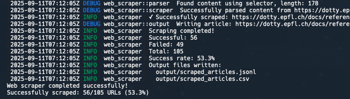

I've been itching to learn Rust for a while! Here I document my brief adventure building a simple Rust web scraper over the course of an afternoon.

My main goal here is of course to learn the very basics of Rust. My secondary goal is to build a method to save a large number of technical posts for for an LLM fine-tuning project I've only just started.

Lastly, disclaimer that I heavily used an AI Agent to write the initial code here. I used VS Code's GH Copilot agent for this project with Claude 4 as the model. I've also had lots of success with Cursor, Claude Code, and Kilo Code (to a smaller extent). I've had a lot of success using agents for general setup and learning for projects that are just for fun like this. I definitely have a long ways to go in learning Rust fundamentals!

If you want to check out the full code, take a look on [Github](https://github.com/ewoodbury/rust-web-scraper).


## Getting Started

### Basic Setup
I installed and set up my Rust environment using [rustup](https://rustup.rs/). I then created a new binary project using `cargo new rust-web-scraper`:

```bash
$ cargo new rust-web-scraper
        Created binary (application) `rust-web-scraper` package
$ cd rust-web-scraper
```


Up next, I set up my cargo.toml with my main project dependencies. From my research, `reqwest` was the most popular HTTP client library, and `scraper` was a popular HTML parsing library. I also added `tokio` for async runtime support. This should be a very conventional stack for Rust.

As a side note, Rust dependencies are just like Poetry for Python! It uses the exact same .toml -> .lock file setup, which I generally like from Poetry. I did some Googling and found that Poetry was heavily inspired by Cargo, which makes sense.

<details>
<summary>Expand to view full cargo.toml:</summary>

```toml
[package]
name = "web-scraper"
version = "0.1.0"
edition = "2025"
authors = ["Ethan Woodbury <ethwoodbury@gmail.com>"]
description = "A web scraper for technical blog posts"
license = "MIT"

[dependencies]
# HTTP client
reqwest = { version = "0.11", features = ["json", "gzip"] }
tokio = { version = "1.0", features = ["full"] }

# HTML parsing
scraper = "0.18"
html5ever = "0.26"

# Serialization
serde = { version = "1.0", features = ["derive"] }
serde_json = "1.0"
csv = "1.3"

# Configuration
config = "0.14"
toml = "0.8"

# CLI
clap = { version = "4.4", features = ["derive"] }

# Logging
log = "0.4"
env_logger = "0.10"

# Error handling
anyhow = "1.0"
thiserror = "1.0"

# URL handling
url = "2.4"

# Date/time
chrono = { version = "0.4", features = ["serde"] }

# Random number generation
rand = "0.8"

[dev-dependencies]
# Testing utilities
tokio-test = "0.4"
wiremock = "0.5"
tempfile = "3.8"
```
</details>
<br />

To verify the project setup: run `cargo check`: 

```bash
$ cargo check
Checking web-scraper v0.1.0 (/Users/ethan/Projects/rust-web-scraper)
    Finished `dev` profile [unoptimized + debuginfo] target(s) in 1.11s
```


### Initial Code

At this point, I got to making a detailed requirements document and architecture plan with Claude. Once we settled on a full list of features and an architecture, I had Claude go ahead with the initial code.

I set up the `main.rs` file and main function to be the entrypoint to the scraper which triggers the following operations:

1. Initialize logger and load scraper configuration (`config.rs`)
2. Initialize output JSON file (where scraped data will be saved)
3. Load the list of URLs to scrape from a text file
4. For each URL:

   - Fetch the HTML content using `reqwest` (`fetcher.rs`)
   - If the request fails, retry with exponential backoff
   - If the request succeeds, parse the HTML content to extract the title, date, and content using `scraper` (`parser.rs`)
   - Save the extracted data to the output JSON file
   - Increment the success or failure counter as appropriate

5. After all URLs are processed, log a summary of successes and failures, and display the path to the output file

And that's it! Very straightforward. 

<details>
<summary>Expand to view the full `main.rs` file</summary>

```rust
// main.rs
use clap::Parser;
use log::{error, info, warn};
use std::fs;
use std::path::Path;
use tokio;
use web_scraper::{config, AppConfig, HttpScraper, OutputWriter};

#[derive(Parser)]
#[command(name = "web-scraper")]
#[command(about = "A web scraper for technical blog posts")]
pub struct Args {
    /// Input file containing URLs (one per line)
    pub input_file: String,

    /// Configuration file path
    #[arg(short, long, default_value = "config/default.toml")]
    pub config: String,

    /// Output directory
    #[arg(short, long)]
    pub output_dir: Option<String>,

    /// Verbose logging
    #[arg(short, long)]
    pub verbose: bool,
}

#[tokio::main]
async fn main() {
    let args = Args::parse();

    // Initialize logger
    if args.verbose {
        // Enable debug logging only for our crate, keep other crates at info level
        env_logger::Builder::from_env(env_logger::Env::default().default_filter_or("web_scraper=debug,info")).init();
    } else {
        env_logger::Builder::from_env(env_logger::Env::default().default_filter_or("info")).init();
    }

    info!("Starting web scraper");
    info!("Input file: {}", args.input_file);
    info!("Config file: {}", args.config);

    // Load configuration
    let mut config = match load_configuration(&args.config) {
        Ok(config) => config,
        Err(e) => {
            error!("Failed to load configuration: {}", e);
            std::process::exit(1);
        }
    };

    // Override output directory if specified
    if let Some(output_dir) = &args.output_dir {
        info!("Overriding output directory: {}", output_dir);
        config.output.directory = output_dir.clone();
    }

    // Load URLs from input file
    let urls = match load_urls(&args.input_file) {
        Ok(urls) => urls,
        Err(e) => {
            error!("Failed to load URLs from {}: {}", args.input_file, e);
            std::process::exit(1);
        }
    };

    info!("Loaded {} URLs to scrape", urls.len());

    // Initialize scraper and output writer
    let mut scraper = match HttpScraper::new(config.scraper.clone()) {
        Ok(scraper) => scraper,
        Err(e) => {
            error!("Failed to initialize scraper: {}", e);
            std::process::exit(1);
        }
    };

    let mut output_writer = match OutputWriter::new(config.output.clone()) {
        Ok(writer) => writer,
        Err(e) => {
            error!("Failed to initialize output writer: {}", e);
            std::process::exit(1);
        }
    };

    // Scrape all URLs
    let mut successful_count = 0;
    let mut failed_count = 0;

    info!("Starting to scrape {} URLs", urls.len());
    
    for (i, url) in urls.iter().enumerate() {
        info!("Scraping URL {}/{}: {}", i + 1, urls.len(), url);
        
        let article = scraper.scrape_url(url).await;
        
        if article.success {
            successful_count += 1;
            info!("✓ Successfully scraped: {}", url);
        } else {
            failed_count += 1;
            warn!("✗ Failed to scrape: {} - {}", url, 
                  article.error_message.as_deref().unwrap_or("Unknown error"));
        }

        // Write the article to output files
        if let Err(e) = output_writer.write_article(&article) {
            error!("Failed to write article to output: {}", e);
        }
    }

    // Flush output writer
    if let Err(e) = output_writer.flush() {
        error!("Failed to flush output: {}", e);
    }

    // Print summary
    info!("Scraping completed!");
    info!("Successful: {}", successful_count);
    info!("Failed: {}", failed_count);
    info!("Total: {}", urls.len());
    
    let success_rate = if urls.is_empty() { 
        0.0 
    } else { 
        (successful_count as f64 / urls.len() as f64) * 100.0 
    };
    info!("Success rate: {:.1}%", success_rate);

    // Show output file locations
    let output_paths = output_writer.get_output_paths();
    info!("Output files written:");
    for path in output_paths {
        info!("  {}", path);
    }

    println!("Web scraper completed successfully!");
    println!("Successfully scraped: {}/{} URLs ({:.1}%)", 
             successful_count, urls.len(), success_rate);
}

/// Load configuration from file, with fallback to default
fn load_configuration(config_path: &str) -> Result<AppConfig, Box<dyn std::error::Error>> {
    if Path::new(config_path).exists() {
        info!("Loading configuration from: {}", config_path);
        Ok(config::load_config(config_path)?)
    } else {
        warn!("Configuration file not found: {}, using default configuration", config_path);
        Ok(AppConfig::default())
    }
}

/// Load URLs from input file
fn load_urls(input_file: &str) -> Result<Vec<String>, Box<dyn std::error::Error>> {
    info!("Loading URLs from: {}", input_file);
    
    let content = fs::read_to_string(input_file)?;
    let urls: Vec<String> = content
        .lines()
        .map(|line| line.trim())
        .filter(|line| !line.is_empty() && !line.starts_with('#'))
        .map(|line| line.to_string())
        .collect();

    if urls.is_empty() {
        return Err("No valid URLs found in input file".into());
    }

    Ok(urls)
}
```
</details>
<br />

### Project Structure

The structure follows a conventional Rust project layout:

```
web-scraper/
├── Cargo.toml
├── Cargo.lock
├── README.md
├── config/
│   └── default.toml
├── src/
│   ├── main.rs
│   ├── lib.rs
│   ├── config.rs
│   ├── scraper.rs
│   ├── parser.rs
│   ├── output.rs
│   ├── models.rs
│   └── error.rs
├── tests/
│   ├── integration_tests.rs
│   ├── fixtures/
│   │   ├── sample_urls.txt
│   │   ├── expected_output.jsonl
│   │   └── test_pages/
│   └── mock_server.rs
├── examples/
│   ├── sample_input.txt
│   └── sample_config.toml
└── target/
```

### Handling robots.txt 

One of the well-known conventions of web scraping is to respect the `robots.txt` file for rules on scraping websites.

I implemented this by with a simple `robots.rs` module that fetches the text file, parses it line by line into key-value pairs, and then builds a set of rules based on user agents and allowed/disallowed paths. Function preview here:

```rust
// robots.rs
impl SimpleRobots {
    fn parse(content: &str) -> Self {
        let mut rules = Vec::new();
        let mut current_user_agents: Vec<String> = Vec::new();
        let mut allowed_paths = Vec::new();
        let mut disallowed_paths = Vec::new();
        let mut crawl_delay = None;

        for line in content.lines() {
            // Loop through file line by line
            let line = line.trim();
            if line.is_empty() || line.starts_with('#') {
                continue;
            }

            // Split on `:`
            if let Some((key, value)) = line.split_once(':') {
                let key = key.trim().to_lowercase();
                let value = value.trim();

                match key.as_str() {
                    "user-agent" => {
                        // Save previous rule if any
                        if !current_user_agents.is_empty() {
                            for ua in &current_user_agents {
                                // Add a new rule for user agent
                                rules.push(RobotRule {
                                    user_agent: ua.clone(),
                                    allowed_paths: allowed_paths.clone(),
                                    disallowed_paths: disallowed_paths.clone(),
                                    crawl_delay,
                                });
                            }
                        }
                // ... remaining rules and parsing logic ...
```

Then, we run the `is_allowed` function to check whether the given URL is permitted based on our current rules.

<details>
<summary>Expand to view full robots.rs file</summary>

```rust 
use crate::error::ScraperError;
use log::{debug, info, warn};
use reqwest::Client;
use std::collections::HashMap;
use std::time::{Duration, Instant};
use url::Url;

/// Simple robots.txt rule
#[derive(Debug, Clone)]
struct RobotRule {
    user_agent: String,
    allowed_paths: Vec<String>,
    disallowed_paths: Vec<String>,
    crawl_delay: Option<f64>,
}

/// Simple robots.txt parser result
#[derive(Debug, Clone)]
struct SimpleRobots {
    rules: Vec<RobotRule>,
}

impl SimpleRobots {
    /// Parse robots.txt content
    fn parse(content: &str) -> Self {
        let mut rules = Vec::new();
        let mut current_user_agents: Vec<String> = Vec::new();
        let mut allowed_paths = Vec::new();
        let mut disallowed_paths = Vec::new();
        let mut crawl_delay = None;

        for line in content.lines() {
            let line = line.trim();
            if line.is_empty() || line.starts_with('#') {
                continue;
            }

            if let Some((key, value)) = line.split_once(':') {
                let key = key.trim().to_lowercase();
                let value = value.trim();

                match key.as_str() {
                    "user-agent" => {
                        // Save previous rule if any
                        if !current_user_agents.is_empty() {
                            for ua in &current_user_agents {
                                rules.push(RobotRule {
                                    user_agent: ua.clone(),
                                    allowed_paths: allowed_paths.clone(),
                                    disallowed_paths: disallowed_paths.clone(),
                                    crawl_delay,
                                });
                            }
                        }

                        // Reset for new user-agent block
                        current_user_agents = vec![value.to_string()];
                        allowed_paths.clear();
                        disallowed_paths.clear();
                        crawl_delay = None;
                    }
                    "allow" => {
                        allowed_paths.push(value.to_string());
                    }
                    "disallow" => {
                        disallowed_paths.push(value.to_string());
                    }
                    "crawl-delay" => {
                        if let Ok(delay) = value.parse::<f64>() {
                            crawl_delay = Some(delay);
                        }
                    }
                    _ => {
                        // Ignore unknown directives
                    }
                }
            }
        }

        // Save the last rule
        if !current_user_agents.is_empty() {
            for ua in &current_user_agents {
                rules.push(RobotRule {
                    user_agent: ua.clone(),
                    allowed_paths: allowed_paths.clone(),
                    disallowed_paths: disallowed_paths.clone(),
                    crawl_delay,
                });
            }
        }

        Self { rules }
    }

    /// Check if a path is allowed for a user agent
    fn is_allowed(&self, user_agent: &str, path: &str) -> bool {
        // Find applicable rules (exact match or wildcard)
        let applicable_rules: Vec<_> = self.rules
            .iter()
            .filter(|rule| rule.user_agent == "*" || rule.user_agent == user_agent)
            .collect();

        if applicable_rules.is_empty() {
            return true; // No rules found, allow access
        }

        // Check rules in order of specificity (specific user-agent before wildcard)
        let mut sorted_rules = applicable_rules;
        sorted_rules.sort_by(|a, b| {
            if a.user_agent == user_agent && b.user_agent == "*" {
                std::cmp::Ordering::Less
            } else if a.user_agent == "*" && b.user_agent == user_agent {
                std::cmp::Ordering::Greater
            } else {
                std::cmp::Ordering::Equal
            }
        });

        for rule in sorted_rules {
            // Check if explicitly allowed
            for allowed in &rule.allowed_paths {
                if path.starts_with(allowed) {
                    return true;
                }
            }

            // Check if disallowed
            for disallowed in &rule.disallowed_paths {
                if disallowed.is_empty() || path.starts_with(disallowed) {
                    return false;
                }
            }
        }

        true // Default to allow if no specific rules match
    }

    /// Get crawl delay for a user agent
    fn get_crawl_delay(&self, user_agent: &str) -> Option<f64> {
        // Look for specific user-agent first, then wildcard
        for rule in &self.rules {
            if rule.user_agent == user_agent {
                return rule.crawl_delay;
            }
        }

        for rule in &self.rules {
            if rule.user_agent == "*" {
                return rule.crawl_delay;
            }
        }

        None
    }
}

/// Cache entry for robots.txt data
#[derive(Debug, Clone)]
struct RobotsCacheEntry {
    robots_txt: Option<SimpleRobots>,
    cached_at: Instant,
}

/// Robots.txt compliance checker with caching
pub struct RobotsChecker {
    client: Client,
    cache: HashMap<String, RobotsCacheEntry>,
    cache_duration: Duration,
    user_agent: String,
}

impl RobotsChecker {
    /// Create a new robots.txt checker
    pub fn new(client: Client, user_agent: String) -> Self {
        Self {
            client,
            cache: HashMap::new(),
            cache_duration: Duration::from_secs(3600), // Cache for 1 hour
            user_agent,
        }
    }

    /// Check if scraping is allowed for the given URL
    pub async fn is_allowed(&mut self, url: &str) -> Result<bool, ScraperError> {
        let parsed_url = Url::parse(url).map_err(|e| {
            ScraperError::ParseError(format!("Invalid URL {}: {}", url, e))
        })?;

        let base_url = format!("{}://{}", parsed_url.scheme(), parsed_url.host_str().unwrap_or(""));
        let robots_url = format!("{}/robots.txt", base_url);

        // Check cache first
        if let Some(entry) = self.cache.get(&base_url) {
            if entry.cached_at.elapsed() < self.cache_duration {
                debug!("Using cached robots.txt for {}", base_url);
                return Ok(self.check_permission(entry, &parsed_url));
            }
        }

        // Fetch robots.txt
        info!("Fetching robots.txt from {}", robots_url);
        let robots_txt = self.fetch_robots_txt(&robots_url).await?;

        // Cache the result
        let entry = RobotsCacheEntry {
            robots_txt,
            cached_at: Instant::now(),
        };
        self.cache.insert(base_url, entry.clone());

        Ok(self.check_permission(&entry, &parsed_url))
    }

    /// Get crawl delay for the given URL (in seconds)
    pub async fn get_crawl_delay(&mut self, url: &str) -> Result<Option<Duration>, ScraperError> {
        let parsed_url = Url::parse(url).map_err(|e| {
            ScraperError::ParseError(format!("Invalid URL {}: {}", url, e))
        })?;

        let base_url = format!("{}://{}", parsed_url.scheme(), parsed_url.host_str().unwrap_or(""));

        // Check cache first
        if let Some(entry) = self.cache.get(&base_url) {
            if entry.cached_at.elapsed() < self.cache_duration {
                if let Some(ref robots) = entry.robots_txt {
                    if let Some(delay) = robots.get_crawl_delay(&self.user_agent) {
                        return Ok(Some(Duration::from_secs_f64(delay)));
                    }
                }
                return Ok(None);
            }
        }

        // If not in cache, trigger a fetch by calling is_allowed
        self.is_allowed(url).await?;

        // Now check again
        if let Some(entry) = self.cache.get(&base_url) {
            if let Some(ref robots) = entry.robots_txt {
                if let Some(delay) = robots.get_crawl_delay(&self.user_agent) {
                    return Ok(Some(Duration::from_secs_f64(delay)));
                }
            }
        }

        Ok(None)
    }

    /// Fetch robots.txt from the given URL
    async fn fetch_robots_txt(&self, robots_url: &str) -> Result<Option<SimpleRobots>, ScraperError> {
        match self.client.get(robots_url).send().await {
            Ok(response) => {
                let status = response.status();
                debug!("Robots.txt response status for {}: {}", robots_url, status);

                if status.is_success() {
                    match response.text().await {
                        Ok(content) => {
                            debug!("Successfully fetched robots.txt from {}", robots_url);
                            let robots = SimpleRobots::parse(&content);
                            Ok(Some(robots))
                        }
                        Err(e) => {
                            warn!("Failed to read robots.txt content from {}: {}", robots_url, e);
                            Ok(None)
                        }
                    }
                } else if status == 404 {
                    debug!("No robots.txt found at {} (404), allowing access", robots_url);
                    Ok(None)
                } else {
                    warn!("Unexpected status {} for robots.txt at {}", status, robots_url);
                    // Be conservative - if we can't fetch robots.txt, allow access
                    Ok(None)
                }
            }
            Err(e) => {
                warn!("Network error fetching robots.txt from {}: {}", robots_url, e);
                // Network errors should not block scraping completely
                Ok(None)
            }
        }
    }

    /// Check if the URL is allowed based on robots.txt rules
    fn check_permission(&self, entry: &RobotsCacheEntry, url: &Url) -> bool {
        if let Some(ref robots) = entry.robots_txt {
            let path = url.path();
            let allowed = robots.is_allowed(&self.user_agent, path);
            debug!("Robots.txt check for {} path '{}': {}", url.host_str().unwrap_or("unknown"), path, 
                if allowed { "ALLOWED" } else { "DISALLOWED" });
            allowed
        } else {
            debug!("No robots.txt rules found, allowing access to {}", url);
            true
        }
    }

    /// Clear the cache (useful for testing)
    pub fn clear_cache(&mut self) {
        self.cache.clear();
    }

    /// Get cache statistics for debugging
    pub fn cache_stats(&self) -> (usize, usize) {
        let total = self.cache.len();
        let expired = self.cache.values()
            .filter(|entry| entry.cached_at.elapsed() >= self.cache_duration)
            .count();
        (total, expired)
    }
}

#[cfg(test)]
mod tests {
    use super::*;

    #[tokio::test]
    async fn test_robots_checker_creation() {
        let client = Client::new();
        let checker = RobotsChecker::new(client, "test-agent/1.0".to_string());
        assert_eq!(checker.cache.len(), 0);
    }

    #[tokio::test]
    async fn test_cache_stats() {
        let client = Client::new();
        let checker = RobotsChecker::new(client, "test-agent/1.0".to_string());
        let (total, expired) = checker.cache_stats();
        assert_eq!(total, 0);
        assert_eq!(expired, 0);
    }

    #[tokio::test]
    async fn test_clear_cache() {
        let client = Client::new();
        let mut checker = RobotsChecker::new(client, "test-agent/1.0".to_string());
        checker.clear_cache();
        assert_eq!(checker.cache.len(), 0);
    }

    #[test]
    fn test_simple_robots_parsing() {
        let content = r#"
User-agent: *
Disallow: /private/
Allow: /public/
Crawl-delay: 1

User-agent: test-bot
Disallow: /
"#;
        let robots = SimpleRobots::parse(content);
        
        // Should disallow everything for test-bot
        assert!(!robots.is_allowed("test-bot", "/anything"));
        
        // Should allow /public/ but disallow /private/ for other bots
        assert!(!robots.is_allowed("other-bot", "/private/test"));
        assert!(robots.is_allowed("other-bot", "/public/test"));
        assert!(robots.is_allowed("other-bot", "/random"));
        
        // Should get crawl delay for wildcard
        assert_eq!(robots.get_crawl_delay("other-bot"), Some(1.0));
        assert_eq!(robots.get_crawl_delay("test-bot"), None);
    }
}

```
</details>
<br />

### Fetching and Parsing

The fetching uses the `reqwest` library to make HTTP GET requests.

Upon failures, the code runs standard exponential backoff retry logic, up to the configured maximum retries. Here's the relevant function:

```rust
/// Fetch URL content with retry logic
    async fn fetch_with_retry(&self, url: &Url) -> Result<String, ScraperError> {
        let mut last_error = None;

        for attempt in 1..=self.config.max_retries {
            debug!("Attempt {} to fetch {}", attempt, url);

            match self.client.get(url.as_str()).send().await {
                Ok(response) => {
                    let status = response.status();
                    debug!("Response status for {}: {}", url, status);

                    if status.is_success() {
                        match response.text().await {
                            Ok(text) => return Ok(text),
                            Err(e) => {
                                last_error = Some(ScraperError::HttpError(e));
                                warn!("Failed to read response text on attempt {}: {}", attempt, last_error.as_ref().unwrap());
                            }
                        }
                    } else {
                        let error = ScraperError::HttpError(reqwest::Error::from(
                            reqwest::Error::from(response.error_for_status().unwrap_err()),
                        ));
                        last_error = Some(error);
                        warn!("HTTP error on attempt {}: {}", attempt, last_error.as_ref().unwrap());
                    }
                }
                Err(e) => {
                    last_error = Some(ScraperError::HttpError(e));
                    warn!("Request failed on attempt {}: {}", attempt, last_error.as_ref().unwrap());
                }
            }

            // Add exponential backoff delay between retries
            if attempt < self.config.max_retries {
                let delay = Duration::from_millis(1000 * (2_u64.pow(attempt - 1)));
                debug!("Waiting {}ms before retry", delay.as_millis());
                sleep(delay).await;
            }
        }
```

The parsing uses the `scraper` library to parse HTML and extract the title, date, and main content. 

```rust
    /// Parse HTML content and extract article information
    pub fn parse(&self, html: &str) -> Result<ParsedContent, ScraperError> {
        let document = Html::parse_document(html);

        let title = self.extract_title(&document);
        let author = self.extract_author(&document);
        let publication_date = self.extract_date(&document);
        let content = self.extract_content(&document)?;

        Ok(ParsedContent {
            title,
            author,
            publication_date,
            content,
        })
    }
```

To find the title, we have to deal with the different styles of specifying layouts across the web. Here's how that is set up:

```rust 
// parser.rs
fn create_title_selectors() -> Result<Vec<Selector>, ScraperError> {
    let selectors = vec![
        "article h1",
        "h1.title",
        "h1.post-title",
        "h1.entry-title",
        ".post-header h1",
        ".article-header h1",
        "[property=\"og:title\"]",
        "title",
        "h1",
    ];

    Self::parse_selectors(&selectors)
}
```

We use similar logic to extract the author and content as well. The `parse_selectors` simply takes in these selectors and matches it against the document: 

```rust
    /// Parse a list of CSS selectors
    fn parse_selectors(selectors: &[&str]) -> Result<Vec<Selector>, ScraperError> {
        let mut parsed = Vec::new();
        for selector_str in selectors {
            match Selector::parse(selector_str) {
                Ok(selector) => parsed.push(selector),
                Err(e) => {
                    warn!("Invalid selector '{}': {:?}", selector_str, e);
                    // Continue with other selectors instead of failing
                }
            }
        }
        Ok(parsed)
    }
```

Once the content is parsed, we return a `ParsedContent` struct with the extracted fields, which gets saved into the output JSON file.

```rust
pub struct ParsedContent {
    pub title: Option<String>,
    pub author: Option<String>,
    pub publication_date: Option<DateTime<Utc>>,
    pub content: String,
}  
```

## Results

I ran the scraper on a list of 105 technical blog posts, all related to Scala.

With the default configuration, and without even implementing concurrent processing, the scraper completed in 7 minutes. It was able successfuly scrape data on 56 out of the 105 URLs, for a success rate of 53.3%.



From a quick poke through, it looked like most of the failures were due to URLs which no longer exist. This also slows down the scraper because of the retry delays. We could improve this dramatically by simply cleaning up the input URL list, and of course by adding concurrency as well.


## Takeaways

### Syntax

I generally am liking Rust's syntax so far. It feels like a mixture of Go, for the error handling, and Scala for the semi-functional style and pattern matching. 

I particularly liked the `match` statement for handling errors, such as in getting responses:
```rust
    match response.text().await {
        Ok(text) => return Ok(text),
        Err(e) => {
            last_error = Some(ScraperError::HttpError(e));
            warn!("Failed to read response text on attempt {}: {}", attempt, last_error.as_ref().unwrap());
        }
    }
```

The usage of `Some()` also reminds me of Scala's safe style of handling optional values, in a good way.

The type annotations are very reasonable, and VS code seems to have excellent support for showing types, docstrings, and function signatures based on the context.

### Project Setup

The Rust project setup is very clean. I've heard awesome things about Cargo and it does not disappoint. Everything just feels like a more refined version of the build systems I'm used to: it's like a cleaner and faster version of Poetry (Python) combined with a smoother and more integrated version of sbt for Scala.

### Performance and Async

Of course, performance is one of the big selling points of Rust. This project isn't near large enough for performance to be a concern yet, but it has felt very snappy so far in both tests and development runs.

The Async support with `tokio` has been very nice as well. The async/await syntax feels similar to Python's, but the experience is just smooth and easy compared to the rough edges with Python.

### Advanced Language Features

With all that said, I'm yet to experience the real power of Rust that I've read about. In the future, I'll definitely want to explore how Rust handles memory safety, ownership, concurrency, and more.

I plan to expand on this project somewhat going forward, but I'm even more excited to start working on Apache DataFusion, which is a data processing engine written in Rust.

## Next Steps

- Add concurrency with `tokio` tasks to speed up scraping
- Implement true web crawling with link extraction and breadth-first traversal
- Add persistent, queryable storage for parsed contents with SQLite or Postgres
- Improve error handling and logging with more granular error types, such as invalid URLs, blocked by robots.txt, parsing failures, etc.


Hope you enjoyed! Again, code is up on [Github](https://github.com/ewoodbury/rust-web-scraper) for you to poke through.