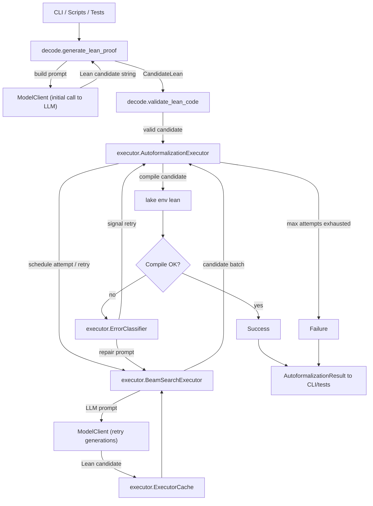

I built a project called Autoformalizer, which is a simple Python tool that builds verifiable proofs for simple math theorems in Lean 4. 

Autoformalizer is a system that passes natural language proof statements to an LLM to iteratively build a formal proof, then passes the proof to the Lean compiler to verify its correctness. It also automatically retries failed proof attempts with intelligent prompting using the error messages from Lean.

This was an incredibly fun and satisfying project! I've been interested in pure math recently after half a decade being away from the math of my undergraduate engineering degree. Plus, it was my first foray into building eval systems for LLMs.

You can check out the full project on [GitHub](https://github.com/ewoodbury/lean-autoformalizer).

## Results

As of today, Autformalizer successfully proves 24 out of 26 simple theorems from an unseen test set, using Grok-4-fast.

On the first attempt, it only proves 11/26, but this increases to 24/26 using up to 4 retries, which shows the intelligent re-prompting upon errors is effective.


```
=== Evaluation Summary ===
Dataset: datasets/test.jsonl
Items evaluated: 26
Successes: 24 (92.3%)
Compile-rate@1: 42.3%

Pass@K:
  Pass@1: 42.3%
  Pass@5: 92.3%
```

<details>
<summary>Click for full results</summary>

```
=== Evaluation Summary ===
Dataset: datasets/test.jsonl
Items evaluated: 26
Successes: 24 (92.3%)
Compile-rate@1: 42.3%

Pass@K:
  Pass@1: 42.3%
  Pass@5: 92.3%

Attempts per proof:
  mean=2.23, median=2.0, p90=4.5

Time per proof (s):
  mean=52.97, median=22.31, p90=162.67

Per-item outcomes:
✅ nat_succ_mul_expand :: attempts=1, success_rank=1, time=10.60s, pass[@1:Y @5:Y]
✅ eq_symm :: attempts=1, success_rank=1, time=4.26s, pass[@1:Y @5:Y]
✅ prop_and_left :: attempts=1, success_rank=1, time=4.05s, pass[@1:Y @5:Y]
✅ prop_and_right :: attempts=1, success_rank=1, time=3.96s, pass[@1:Y @5:Y]
✅ nat_add_right_cancel :: attempts=4, success_rank=8, time=80.62s, pass[@1:N @5:Y]
✅ nat_succ_lt_succ :: attempts=1, success_rank=1, time=6.69s, pass[@1:Y @5:Y]
✅ nat_zero_add_left :: attempts=1, success_rank=1, time=5.00s, pass[@1:Y @5:Y]
✅ list_reverse_reverse :: attempts=1, success_rank=1, time=6.09s, pass[@1:Y @5:Y]
✅ list_length_reverse :: attempts=4, success_rank=9, time=70.87s, pass[@1:N @5:Y]
✅ list_map_append :: attempts=3, success_rank=5, time=43.57s, pass[@1:N @5:Y]
✅ set_inter_assoc :: attempts=1, success_rank=1, time=10.86s, pass[@1:Y @5:Y]
✅ set_union_self :: attempts=2, success_rank=3, time=21.18s, pass[@1:N @5:Y]
✅ set_inter_self :: attempts=2, success_rank=2, time=20.38s, pass[@1:N @5:Y]
✅ int_mul_assoc :: attempts=1, success_rank=1, time=4.51s, pass[@1:Y @5:Y]
✅ int_distrib_left :: attempts=2, success_rank=3, time=78.94s, pass[@1:N @5:Y]
✅ int_neg_add :: attempts=5, success_rank=15, time=275.90s, pass[@1:N @5:Y]
✅ function_injective_comp :: attempts=4, success_rank=11, time=139.31s, pass[@1:N @5:Y]
❌ function_surjective_comp :: attempts=5, success_rank=-, time=186.02s, pass[@1:N @5:N]
✅ eq_congr_fun :: attempts=2, success_rank=2, time=23.83s, pass[@1:N @5:Y]
✅ eq_congr_arg :: attempts=2, success_rank=2, time=23.44s, pass[@1:N @5:Y]
✅ nat_succ_inj :: attempts=2, success_rank=4, time=35.26s, pass[@1:N @5:Y]
✅ nat_le_succ_self :: attempts=2, success_rank=3, time=30.39s, pass[@1:N @5:Y]
✅ nat_lt_succ_self :: attempts=1, success_rank=1, time=10.18s, pass[@1:Y @5:Y]
✅ prop_or_true :: attempts=1, success_rank=1, time=8.57s, pass[@1:Y @5:Y]
✅ nat_dvd_refl :: attempts=3, success_rank=6, time=85.59s, pass[@1:N @5:Y]
❌ nat_dvd_trans :: attempts=5, success_rank=-, time=187.06s, pass[@1:N @5:N]
✓ Tests and evaluation metrics completed
```
</details>
<br />

Autoformalizer also includes a CLI that lets you run any theorem you want, to see if the LLM can prove it:

```
$ uv run autoformalizer decode

Starting interactive decoder...
Statement:  If functions f and g are surjective, then f∘g is surjective.
Proof steps (optional, separate entries with ';'):

=== Lean Candidate ===
import Mathlib.Function

variable {α β γ : Type*}

theorem surjective_comp {f : β → γ} {g : α → β} (hf : Surjective f) (hg : Surjective g) :
    Surjective (f ∘ g) := by
  intro z
  rcases hf z with ⟨y, hy⟩
  rcases hg y with ⟨x, hx⟩
  use x
  rw [hx, hy]

Validation: Success! (7.21s)
```


## Lean

Lean is a functional programming language, but more specifically an interactive theorem prover, which means it can be used to construct and verify mathematical proofs. A significant amount of math research over the last few years has heavily utilized Lean. One notable example is Kevin Buzzard and Richard Taylor's work to formalize [Fermat's Last Theorem in Lean](https://imperialcollegelondon.github.io/FLT/blueprint.pdf).

Lean in particular has been picked up by AI research teams alongside the rise of LLMs. [DeepMind's AlphaProof](https://deepmind.google/discover/blog/ai-solves-imo-problems-at-silver-medal-level/) used Lean 4 and won the 2024 IMO Silver Medal ([code](https://storage.googleapis.com/deepmind-media/DeepMind.com/Blog/imo-2024-solutions/index.html)). The startup [Math Inc.](https://www.math.inc/) recently published a complete formalization of the strong Prime Number Theorem in Lean 4, and is working to expand their autoformalizer. 

It's an exciting time for Lean, and for pure math in general!

## Architecture

The logical flow for the Autoformalizer is as follows:
1. A proof statement is passed into Autoformalizer (via CLI from user, or from test dataset)
2. The statement is passed to the LLM to generate a candidate Lean proof
3. The candidate proof passed to the Lean compiler to verify its correctness
  i. If it compiles, return success
  ii. If it doesn't compile, construct an updated prompt using the error message and pass back to LLM
  iii. If max attempts is reached, return failure
4. Upon failures, or if configured for initial runs, also pass the candidate proof and statement to the Beam Search Executor, which generates and tests multiple candidates in parallel with various temperature and beam width settings.


## Initial Prompt

The initial prompt is extremely simple: it explains the task to the LLM, and the provides a simple example of a statement plus proof pair.

```python
ENGLISH_TO_LEAN_PROMPT = (
    "Given this mathematical statement in English, generate a complete Lean 4 theorem:\n\n"
    "English: {statement}\n"
    "Steps: {steps}\n\n"
    "Generate the complete Lean theorem including imports and proof.\n"
    "Use tactic mode with 'by' and keep it concise.\n\n"
    "Example:\n"
    'English: "For all natural numbers a and b, a + b = b + a"\n'
    'Steps: ["Use commutativity of addition on naturals"]\n\n'
    "Lean:\n"
    "```lean\n"
    "import Mathlib/Data/Nat/Basic\n\n"
    "theorem add_comm_nat (a b : Nat) : a + b = b + a := by\n"
    "  rw [Nat.add_comm]\n"
    "```\n\n"
    "Your turn:\n"
    "English: {statement}\n"
    "Steps: {steps}\n\n"
    "Lean:\n"
)
```

I haven't done any tuning on this prompt yet. My intuition is providing additional examples would be very helpful, especially if we try with more complex proofs. I think it could also clearly outline what imports and Mathlib modules are available, as import errors are a common failure mode currently.


## Error Recovery

One key feature of this Autoformalizer is its ability to automatically retry failed proof attempts to prompt retries. This is very effective: the proof success rate increases from 11/26 (42%) on the first attempt to 24/26 (92%) with up to 4 retries!

### Re-prompts

The reprompt strategy is straightforward: 
1. When a proof candidate fails to compile, save the error message from the Lean compiler
2. Classify the error message into one of `type_mismatch`, `tactic_failed`, `missing_premise`, `syntax_error`, or `other`
3. Construct a new prompt that includes the original proof statement, the failed candidate, and the classified error message
4. Pass the new prompt back to the LLM to generate a new candidate proof 

The error classification uses simple regex logic.

<details>
<summary>Click to expand error classification logic</summary>

```python
# Error pattern matchers with categories
ERROR_PATTERNS = [
    # Unknown identifier patterns
    (ErrorCategory.UNKNOWN_IDENTIFIER, re.compile(r"unknown identifier '([^']+)'")),
    (ErrorCategory.UNKNOWN_IDENTIFIER, re.compile(r"failed to resolve '([^']+)'")),
    (ErrorCategory.UNKNOWN_IDENTIFIER, re.compile(r"'([^']+)' has not been declared")),
    # Type mismatch patterns
    (ErrorCategory.TYPE_MISMATCH, re.compile(r"type mismatch")),
    (ErrorCategory.TYPE_MISMATCH, re.compile(r"expected .+, got .+")),
    (ErrorCategory.TYPE_MISMATCH, re.compile(r"has type .+ but is expected to have type")),
    # Tactic failure patterns
    (ErrorCategory.TACTIC_FAILED, re.compile(r"tactic failed")),
    (ErrorCategory.TACTIC_FAILED, re.compile(r"unsolved goals")),
    (ErrorCategory.TACTIC_FAILED, re.compile(r"goal state:")),
    (ErrorCategory.TACTIC_FAILED, re.compile(r"invalid tactic")),
    # Missing premise patterns
    (ErrorCategory.MISSING_PREMISE, re.compile(r"could not synthesize")),
    (ErrorCategory.MISSING_PREMISE, re.compile(r"no applicable rules")),
    (ErrorCategory.MISSING_PREMISE, re.compile(r"failed to prove")),
    # Syntax error patterns
    (ErrorCategory.SYNTAX_ERROR, re.compile(r"unexpected token")),
    (ErrorCategory.SYNTAX_ERROR, re.compile(r"expected '\)'")),
    (ErrorCategory.SYNTAX_ERROR, re.compile(r"expected '\]'")),
    (ErrorCategory.SYNTAX_ERROR, re.compile(r"expected '\}'")),
    (ErrorCategory.SYNTAX_ERROR, re.compile(r"invalid expression")),
]

def classify_lean_error(stderr: str) -> list[LeanError]:
    """Parse stderr and return classified errors with fix suggestions."""
    if not stderr.strip():
        return []

    errors = []
    lines = stderr.strip().split("\n")

    for line in lines:
        line = line.strip()
        if not line:
            continue

        # Try to classify each line as a potential error
        error = _process_error_block([line], stderr)
        if error:
            errors.append(error)

    # If no errors found, create a generic one
    return errors if errors else [_create_other_error(stderr)]
```
</details>
<br />

Then, the new prompt is constructed with a simple guide according to the error category. For example, for an `unknown_identifier` error, the prompt finds what was unknown then suggests the LLM to import it properly:

```python
if category == ErrorCategory.UNKNOWN_IDENTIFIER:
    # Extract identifier name if possible
    match = re.search(r"'([^']+)'", message)
    if match:
        identifier = match.group(1)
        suggestions.extend(
            [
                f"Add import for '{identifier}'",
                f"Check spelling of '{identifier}'",
                f"Use correct namespace for '{identifier}'",
            ]
        )
    else:
        suggestions.append("Check imports and identifier spelling")
```

I spent some time tuning the prompt templates, but for the most part the basic context was all that was needed. This type of rapid, targeted feedback loop seems to be one of the most effective ways to getting correct results from LLMs (similar to type checks/compiler errors for LLMs generating code).

### Beam search

Beam search is a parallel sampling strategy that improves error recovery for proofs. Instead of generating only one proof candidate during retries, it generates several candidates with slightly different randomness.

On each subsequent retry, the executor increases the beam width and temperature to explore a wider candidate space, increasing the odds of finding a valid proof.

- `BeamSearchExecutor` constructs prompts for each beam slot. Initial attempts call into the decode prompt template; repair attempts call `generate_repair_prompt` with the primary classified error.

- The default `beam_schedule` is `[1, 3, 3, 5, 5]`, meaning the first attempt generates 1 candidate, and later retries generate up to 5 candidates. 
- The default `temperature_schedule` is `[0.3, 0.5, 0.5, 0.7, 0.8]`, which effectively means the LLM starts out more deterministic and gradually becomes more exploratory.

Again, I only spent limited time tuning this for now; increasing the beam width and temperature helped somewhat, but not nearly as much as re-prompting with context. The additional calls do significantly increase the runtime and cost, so this is what I would focus on optimizing before running this at scale, and on harder theorems.

## Conclusion

### Future work

Again, this was a fun project! I was very pleased with being able to build an end-to-end autoformalization system around Lean in about a week, especially given it can successfully prove the vast majority of the simple theorems in the test set.

If I continue this project, the biggest next step is testing against more complex theorems, and to run tests without providing suggested steps to the LLM. The current train and test sets are comprised of simple or even trivial theorems, with half of them being only a single-line proof. This is enough to still evaluate the LLM's adherence to correct Lean 4 syntax, but it doesn't reach the level of testing mathematical reasoning.

It might also be fun to expand this to be a true LLM evaluation suite, where any LLM can be plugged in and have its mathemtical reasonning tested. I found some published benchmarks on this such as Epoch AI's [FrontierMath](https://epoch.ai/frontiermath), but it's still a relatively unexplored area.

### Formal methods and LLM reliability

Hallucination and unpredictability are well-known issues with current LLMs. Formal methods seem like a promising avenue for improving the reliability of LLMs in production or safety-critical settings. The same way that a compiler enforces the correctness of a program's syntax and types, formal methods can enforce the correctness of an entire program.

Pure math is a perfect playground for exploring this world with LLMs. There's a corpus of formalized proofs in Lean, and the correctness of a proof can be verified by the Lean compiler. Yet there's also a huge number of both solved and unsolved problems that require creativity.

I think math research will be impacted heavily by LLMs in the next few years, the same way that programming has already been irreversibly changed. Still, I think the more interesting aspect is whether Lean, or formal methods in general, can be used to improve the reliability of AI systems at their core.