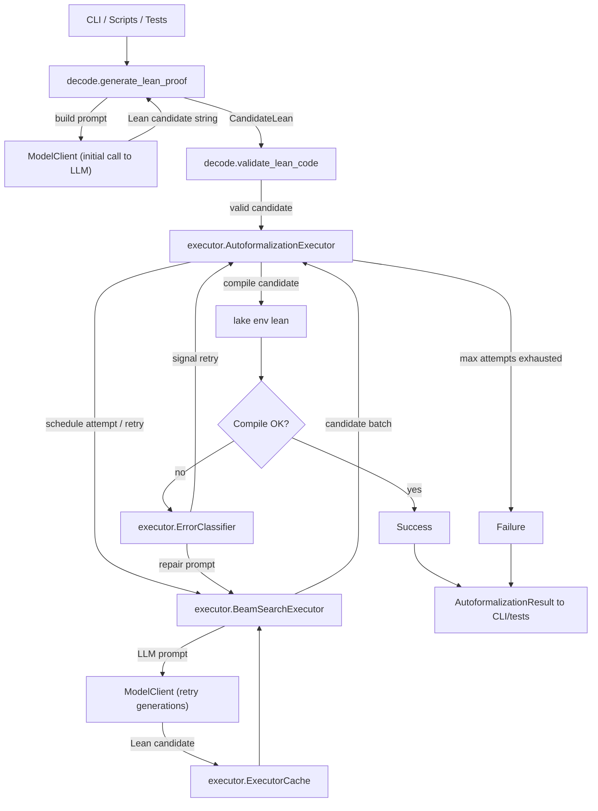

I spent the last week building a project called Autoformalizer, a simple Python tool that builds verifiable proofs for simple math theorems in Lean 4. 

Autoformalizer is a scaffold that passes natural language proof statements to an LLM to iteratively build a formal proof, then passes the proof to the Lean compiler to verify its correctness. It also automatically retries failed proof attempts with intelligent prompting using the error messages from Lean.

This was an incredibly fun and satisfying project! I've been interested in pure math recently after half a decade being away from the math of my undergraduate engineering degree. Plus, it was my first foray into building a true eval system for LLMs.

# Results

As of today, Autformalizer successfully proves 24 out of 26 simple theorems from an unseen test set, using Grok-4-fast.

On the first attempt, it only proves 11/26, but this increases to 24/26 using up to 4 retries, which shows the intelligent re-prompting upon errors is effective.


```
=== Evaluation Summary ===
Dataset: datasets/test.jsonl
Items evaluated: 26
Successes: 24 (92.3%)
Compile-rate@1: 42.3%

Pass@K:
  Pass@1: 42.3%
  Pass@5: 92.3%
```

<details>
<summary>Click to expand detailed results</summary>

```
=== Evaluation Summary ===
Dataset: datasets/test.jsonl
Items evaluated: 26
Successes: 24 (92.3%)
Compile-rate@1: 42.3%

Pass@K:
  Pass@1: 42.3%
  Pass@5: 92.3%

Attempts per proof:
  mean=2.23, median=2.0, p90=4.5

Time per proof (s):
  mean=52.97, median=22.31, p90=162.67

Per-item outcomes:
✅ nat_succ_mul_expand :: attempts=1, success_rank=1, time=10.60s, pass[@1:Y @5:Y]
✅ eq_symm :: attempts=1, success_rank=1, time=4.26s, pass[@1:Y @5:Y]
✅ prop_and_left :: attempts=1, success_rank=1, time=4.05s, pass[@1:Y @5:Y]
✅ prop_and_right :: attempts=1, success_rank=1, time=3.96s, pass[@1:Y @5:Y]
✅ nat_add_right_cancel :: attempts=4, success_rank=8, time=80.62s, pass[@1:N @5:Y]
✅ nat_succ_lt_succ :: attempts=1, success_rank=1, time=6.69s, pass[@1:Y @5:Y]
✅ nat_zero_add_left :: attempts=1, success_rank=1, time=5.00s, pass[@1:Y @5:Y]
✅ list_reverse_reverse :: attempts=1, success_rank=1, time=6.09s, pass[@1:Y @5:Y]
✅ list_length_reverse :: attempts=4, success_rank=9, time=70.87s, pass[@1:N @5:Y]
✅ list_map_append :: attempts=3, success_rank=5, time=43.57s, pass[@1:N @5:Y]
✅ set_inter_assoc :: attempts=1, success_rank=1, time=10.86s, pass[@1:Y @5:Y]
✅ set_union_self :: attempts=2, success_rank=3, time=21.18s, pass[@1:N @5:Y]
✅ set_inter_self :: attempts=2, success_rank=2, time=20.38s, pass[@1:N @5:Y]
✅ int_mul_assoc :: attempts=1, success_rank=1, time=4.51s, pass[@1:Y @5:Y]
✅ int_distrib_left :: attempts=2, success_rank=3, time=78.94s, pass[@1:N @5:Y]
✅ int_neg_add :: attempts=5, success_rank=15, time=275.90s, pass[@1:N @5:Y]
✅ function_injective_comp :: attempts=4, success_rank=11, time=139.31s, pass[@1:N @5:Y]
❌ function_surjective_comp :: attempts=5, success_rank=-, time=186.02s, pass[@1:N @5:N]
✅ eq_congr_fun :: attempts=2, success_rank=2, time=23.83s, pass[@1:N @5:Y]
✅ eq_congr_arg :: attempts=2, success_rank=2, time=23.44s, pass[@1:N @5:Y]
✅ nat_succ_inj :: attempts=2, success_rank=4, time=35.26s, pass[@1:N @5:Y]
✅ nat_le_succ_self :: attempts=2, success_rank=3, time=30.39s, pass[@1:N @5:Y]
✅ nat_lt_succ_self :: attempts=1, success_rank=1, time=10.18s, pass[@1:Y @5:Y]
✅ prop_or_true :: attempts=1, success_rank=1, time=8.57s, pass[@1:Y @5:Y]
✅ nat_dvd_refl :: attempts=3, success_rank=6, time=85.59s, pass[@1:N @5:Y]
❌ nat_dvd_trans :: attempts=5, success_rank=-, time=187.06s, pass[@1:N @5:N]
✓ Tests and evaluation metrics completed
```
</details>
<br />

Autoformalizer also includes a CLI that lets you run any theorem you want, to see if the LLM can prove it:

```
$ uv run autoformalizer decode

Starting interactive decoder...
Statement:  If functions f and g are surjective, then f∘g is surjective.
Proof steps (optional, separate entries with ';'):

=== Lean Candidate ===
import Mathlib.Function

variable {α β γ : Type*}

theorem surjective_comp {f : β → γ} {g : α → β} (hf : Surjective f) (hg : Surjective g) :
    Surjective (f ∘ g) := by
  intro z
  rcases hf z with ⟨y, hy⟩
  rcases hg y with ⟨x, hx⟩
  use x
  rw [hx, hy]

Validation: Success! (7.21s)
```


## Background

### Lean

Lean is a functional programming language, but more specifically an interactive theorem prover, which means it can be used to construct and verify mathematical proofs. A significant amount of math research over the last few years has heavily utilized Lean. One notable example is Kevin Buzzard and Richard Taylor's work to formalize [Fermat's Last Theorem in Lean](https://imperialcollegelondon.github.io/FLT/blueprint.pdf).

Lean in particular has been picked up by AI research teams alongside the rise of LLMs. [DeepMind's AlphaProof](https://deepmind.google/discover/blog/ai-solves-imo-problems-at-silver-medal-level/) used Lean 4 and won the 2024 IMO Silver Medal ([code](https://storage.googleapis.com/deepmind-media/DeepMind.com/Blog/imo-2024-solutions/index.html)). The startup [Math Inc.](https://www.math.inc/) recently published a complete formalization of the strong Prime Number Theorem in Lean 4, and is working to expand their autoformalizer. 

In short, it's an exciting time for Lean, and for pure math in general!

### Formal Methods and Alignment

Hallucination and unpredictability are two well-known issues with current frontier LLMs. Since formal methods provide a way to verify the correctness of systems, they are a promising avenue for improving the reliability of LLMs in production or safety-critical settings. The same way that a compiler enforces the correctness of a program's syntax and types, formal methods can enforce the correctness of an entire program.

Pure math is a perfect playground for exploring this world with LLMs. There is a corpus of formalized proofs in Lean, and the correctness of a proof can be verified by the Lean compiler itself. Yet, advanced math still requires creativity and deep reasoning, providing a challenge for today's frontier LLMs.

I think math research will be impacted heavily by LLMs in the next few years, the same way that programming has been irreversibly changed already today. Still, I think the more interesting aspect is whether Lean, or formal methods in general, can be used to structurally improve the core reliability of AI systems. 


## Architecture

I've done my best to map out the entire logical flow of Autoformalizer below. 

In summary:
1. A proof statement is passed into Autoformalizer (via CLI from user, or from test dataset)
2. The statement is passed to the LLM to generate a candidate Lean proof
3. The candidate proof passed to the Lean compiler to verify its correctness
  i. If it compiles, return success
  ii. If it doesn't compile, construct an updated prompt using the error message and pass back to LLM
  iii. If max attempts is reached, return failure
4. Upon failures, or if configured for initial runs, also pass the candidate proof and statement to the Beam Search Executor, which generates and tests multiple candidates in parallel with various temperature and beam width settings.



## Error Recovery with Prompting

