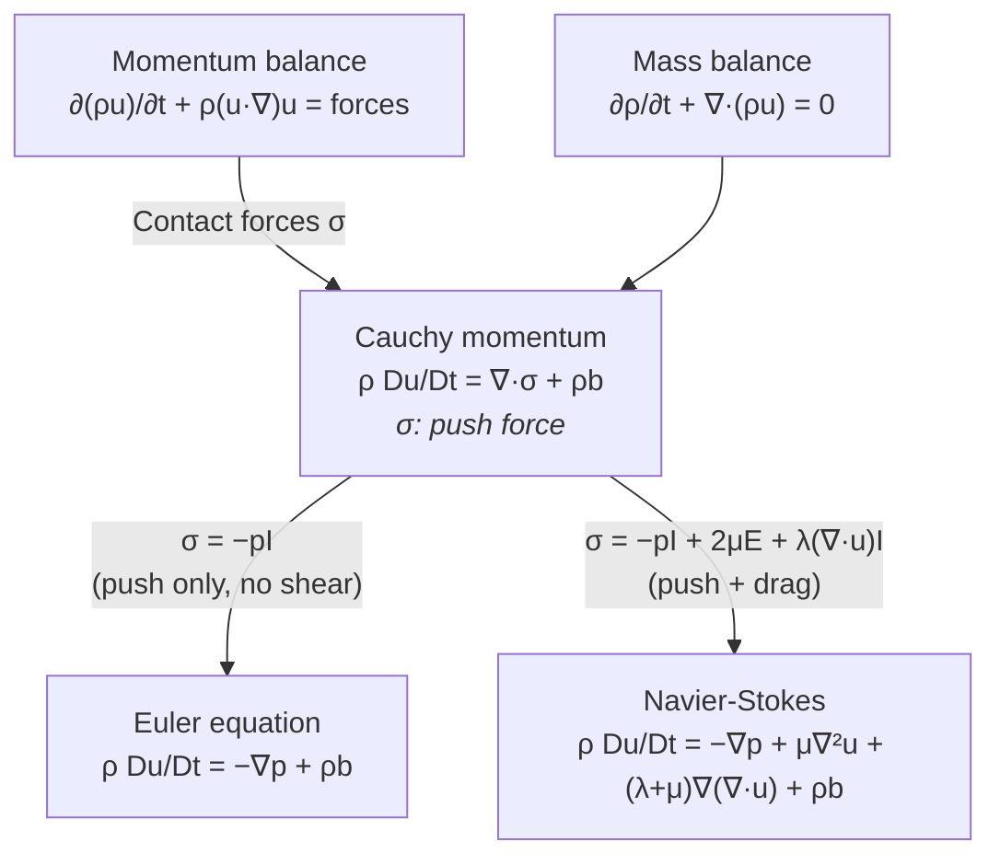

We know the solution to another Millennium Prize problem! Navier-Stokes is the one problem with the most connection to the physical world; it's probably the problem that anyone has at least a chance to fully understand, at least for the raw equations themselves. I took the opportunity to refamiliarize myself with this math, and to put together an introduction for anyone wanting an intuitive understanding. 

This post covers the Navier Stokes equations themselves; I don't cover the contributions of Buckmaster/Alpoge or OpenAI here yet.

I wrote this to be accessible to anyone with basic physics and algebra knowledge. I still include the full math too, as that's what exposes you the the real equations, but you should be able to skim them and still understand the physical meaning. To fully grasp the math, you'll need familiarity partial differential equations, gradient and divergence, and basic linear algebra (matrix math).

---

Fluid dynamics is the study of forces on a continuous mass (liquids and gasses), in contrast to rigid body dynamics. In that sense, one could think of fluid dynamics as extending the typical dynamics concepts from Physics 1 (\(F = ma\), \(\tau = rF \sin\theta\)) onto a body of infinitesimally small objects, until you reach the point of modeling the forces on a single continuous, flowing mass. It's similar to going from algebra to calculus, where we go from discrete variables to continuous quantities at tiny scales (This is of course an oversimplification, but it helps frame the question of "what is fluid dynamics" and explains how we came up with this new set of equations.)

## Mass Balance

The key concepts to know are the physical laws of conservation, and how we can use that to build a balance. We'll start by tracking the volume of an incompressible fluid like water (not truly incompressible but close enough for today). Within an open container, and assuming no chemical reactions or phase changes, water can never be created nor destroyed.

Thus to track water volume, we build a simple balance, which tracks quantity changes against a known conserved constant. In words, our balance is `( net inflow )  +  ( net outflow )  =  0`, where zero is the consant saying volume is conserved. In math, that balance is \(\nabla \cdot \mathbf{u} = 0\), where \(\mathbf{u}\) is what we use for velocity, and \(\nabla \cdot\) is the divergence operator and essentially means the total outward change in volume, summed across all 3 dimensions.

Volume Balance:

\[
\nabla \cdot \mathbf{u} = 0
\]

In physical terms, this is intuitive: if you hold a straw in a flowing stream, the amount of water in it is always constant, as the volume of water flowing in is exactly equal to the volume flowing out.

Now, if instead of water, let's handle a compressible fluid like air. If you hold a straw in a stream of air, and a large gust blows through it, then for an instant there is more mass of air in the straw. We account for this by adding a density term. The mass balance still holds since no mass is created or destroyed; it just now tracks the change of mass over time inside the volume. Since it's a constant control volume, we divide by the volume to track change in density (\(\rho\)) instead:

Mass Balance:

\[
\frac{\partial \rho}{\partial t} + \nabla \cdot (\rho \mathbf{u}) = 0
\]

Here, the \(\partial \rho / \partial t\) term is the "partial derivative" change (\(\partial\)) in density (\(\rho\)) over time (\(t\)). The divergence (\(\nabla \cdot\)) operator accounts for the possible density difference of flow in versus out. Again, the zero reflects conservation of mass.

Annotated, this is:

\[
\underbrace{\frac{\partial \rho}{\partial t}}_{\text{change inside}} +
\underbrace{\nabla \cdot (\rho \mathbf{u})}_{\text{carried by the flow}} =
\underbrace{0}_{\text{no way to create it}}
\]

## Momentum Balance (Euler Equation)

Mass balances are easy to visualize and understand, but momentum is another quantity which is conserved. We'll use that property to build a momentum balance, and this is the foundation that will actually build up to Navier-Stokes.

You might remember from basic physics that momentum is `mass * velocity`, and mass is `density * volume`. We'll assume a constant volume throughout this example (a control volume), so we divide by the constant volume to track momentum in terms of density instead. Therefore we'll balance on the momentum term \(\rho \mathbf{u}\).

For momentum inflows and outflows, we again track the changes at the edge of the container, just like for mass. Here that term is \((\mathbf{u} \cdot \nabla)\mathbf{u}\).

The last term accounts for the change in momentum from forces. Unlike mass, momentum in the volume can also change without anything flowing across the boundary. Any such momentum change must come from an applied force (from Newton's 2nd Law \(F = ma\)).

For fluids, the momentum from external forces is split into two terms. The first is body forces, expressed as \(\rho \mathbf{b}\). \(\rho\) is still density, and \(b\) is simply the force per unit mass, which we take as gravity (\(9.8\,\text{m/s}^2\)). This term is exactly the same as for a rigid body (\(F_{\text{gravity}} = mg\)) since gravity acts the same on both.

The second term is pressure in the fluid. A fluid is fully made up of particles constantly colliding with each other, with each collision exerting a force. From Newton's 3rd law, every force has an equal and opposite reaction, so all collisions cancel out forces in pairs. The only forces not cancelled are those at the edges, from forces coming from outside of the control volume. 

We simply express the net force as \(-\nabla p\) (note the minus sign: the force points from high pressure toward low), where \(\nabla\) (without the dot) is the gradient operator and means the change in all 3 dimensions. Simply having high versus low pressure doesn't make a difference; it's the net force due to the difference in pressures on different sides of the volume.

At this point, we can put together the full momentum balance:

Euler Momentum balance:

\[
\underbrace{\frac{\partial (\rho \mathbf{u})}{\partial t}}_{\text{change inside}} +
\underbrace{\rho (\mathbf{u} \cdot \nabla)\mathbf{u}}_{\text{carried by the flow}} =
\underbrace{-\nabla p + \rho \mathbf{b}}_{\text{created by forces}}
\tag{$\star$}
\]
(Note this can also be shown with the full outer product term \(\otimes\) or full partial differential equations in 3D.)

In words, the momentum change inside the volume plus the momentum change from inflows and outflows, must always equal the net forces exerted on the volume.

Therefore, we have analogous balances for both mass and momentum now, all descending from the basic laws of physics. These are the basic building blocks from which Navier Stokes is built.

At this point, we already have an incredibly useful governing equation in Euler, both for real applications inf luids (airflow, weather, flow through pipes), and for mathematical explorations. In fact, Euler was the equation attacked by the team of Buckmaster + Alpoge in their recent research.

Next, we'll add viscosity, which is shear (dragging) force of the fluid upon itself, such as when spreading honey.

## Shear Forces (Cauchy momentum)

Now, note that pressure is the common way of thinking about forces in fluids; the outside pressure is always pointed inward. In a more general sense, there can be sideways and diagonal forces on a volume of fluid. We use \(\boldsymbol{\sigma}\) for this tensor force instead of pressure \(p\).

In practical terms, \(\boldsymbol{\sigma}\) is a field in 3-dimensions: in this no-shear case it is entirely determined by the pressure. Water at 1 meter depth is at ~1.1 atm of pressure, so:

\[
\boldsymbol{\sigma} \approx
\begin{bmatrix}
-1.1\times 10^5 & 0 & 0 \\
0 & -1.1\times 10^5 & 0 \\
0 & 0 & -1.1\times 10^5
\end{bmatrix} \, \text{Pa}
\]

If pressure doubles, those values double as well. But the non-diagonal terms which represent the shear forces are zero here because we're assuming the fluid is at rest; the only force is the inward pressure. When the fluid moves, those terms become nonzero.

Still, in low-viscosity fluids this shear force from movement is small. Imagine putting a layer of water between two flat baking pans and sliding them past each other: there is very little resistance even though the water is moving.

But what if that were a layer of honey instead: now there is significant resistance to sliding the two pans. This is because honey has viscosity: it conducts the shear forces within itself and thus resists a change in momentum even when under the same force (although this shear force is ~100x less than the inward pressure force).

In this case, with honey being sheared between the two sliding pans, our sigma term might instead be:

\[
\boldsymbol{\sigma} \approx
\begin{bmatrix}
-1.1\times 10^5 & -0.5\times 10^3 & -0.5\times 10^3 \\
-0.5\times 10^3 & -1.1\times 10^5 & -0.5\times 10^3 \\
-0.5\times 10^3 & -0.5\times 10^3 & -1.1\times 10^5
\end{bmatrix} \, \text{Pa}
\]

With this generalization of shear force included, we arrive at the full Cauchy momentum balance:
Cauchy Momentum Equation:

\[
\rho \left[ \frac{\partial \mathbf{u}}{\partial t} + (\mathbf{u} \cdot \nabla)\mathbf{u} \right] = \nabla \cdot \boldsymbol{\sigma} + \rho \mathbf{b}
\tag{$\star$}
\]

which, using the material derivative `D/Dt` from the Euler section, simplifies to the compact Cauchy equation:

\[
\rho \frac{D\mathbf{u}}{Dt} = \nabla \cdot \boldsymbol{\sigma} + \rho \mathbf{b}
\]

## Final Steps to Navier-Stokes

### Viscous Forces

We already saw that in the no-viscosity case, \(\boldsymbol{\sigma}\) was simply set as \(-p\mathbf{I}\), and with the full Cauchy, \(\boldsymbol{\sigma}\) does include the additional stress terms.

In math, this can be shown as:

\[
\boldsymbol{\sigma} = -p\mathbf{I} + \boldsymbol{\sigma}^{v}
\]
where \(\mathbf{I}\) is the identity matrix (think of it as multiplying by 1 but in 3D), and \(\boldsymbol{\sigma}^{v}\) is the term for the viscous forces only.

Next up though, we break down \(\boldsymbol{\sigma}^{v}\) into smaller terms that inform the forces actually involved. We do so as:

\[
\boldsymbol{\sigma}^{v} = (\text{some tensor constant}) \times (\text{rate of deformation})
\]
The tensor constant is the physical property, it only depends on what the fluid is that we're working with. Water has low viscosity while honey has high, so that tensor constant is higher for honey and it transfers more momentum across the fluid body for a given force.

The rate of deformation is also intuitive: the faster you slide the two pans across the liquid, the greater the force. We can further break down this rate term:

\[
\boldsymbol{\sigma}^{v} =
\underbrace{2\mu \mathbf{E}}_{\text{resists shearing}} +
\underbrace{\lambda (\nabla \cdot \mathbf{u})\mathbf{I}}_{\text{resists expansion/compression}}
\]
The rate term consists of shear forces (side-to-side) and normal forces (in and out), each of which has its own viscosity constant per fluid: \(\mu\) as the shear viscosity, and \(\lambda\) as the bulk viscosity. Again, shear is the sliding force: water versus honey. Bulk viscosity is a bit harder to visualize, but it is the resistance to a rapid change in volume: internal friction during a fast squeeze or expansion. (This is separate from compressiblity, which is the overall ability to change volume regardless of rate.)

Then, \(\mathbf{E}\) and \((\nabla \cdot \mathbf{u})\) are simply the deformation rates. Faster sliding means higher \(\mathbf{E}\), and faster compression/expansion means higher magnitude of \((\nabla \cdot \mathbf{u})\). More explicitly, to break down to simplest terms, \(\mathbf{E}\) can be given as:

\[
\mathbf{E} = \tfrac{1}{2} \left( \nabla \mathbf{u} + \nabla \mathbf{u}^{T} \right)
\]
to be in terms of the same velocity gradient \(\nabla \mathbf{u}\) and its transpose \(\nabla \mathbf{u}^{T}\) (from matrix algebra).

Therefore, we arrive at:

\[
\boldsymbol{\sigma}^{v} = 2\mu \mathbf{E} + \lambda(\nabla \cdot \mathbf{u})\mathbf{I} = \mu \left( \nabla \mathbf{u} + \nabla \mathbf{u}^{T} \right) + \lambda(\nabla \cdot \mathbf{u})\mathbf{I}
\]

### Putting it all Together

At this point, it's a pure algebra exercise, with the goal of simplifying everything down to the basic variables of density \(\rho\), velocity \(\mathbf{u}\), and constants.

First we take our new shear viscosity term \(\boldsymbol{\sigma}^{v}\) and apply the divergence operator, since that's where Cauchy has the \(\boldsymbol{\sigma}\) (assuming the viscosities \(\mu\) and \(\lambda\) are uniform across the fuild):

\[
\nabla \cdot \boldsymbol{\sigma}^{v} = \mu \nabla^2 \mathbf{u} + \mu \nabla(\nabla \cdot \mathbf{u}) + \lambda \nabla(\nabla \cdot \mathbf{u})
\]

\[
\begin{aligned}
\rho \frac{D\mathbf{u}}{Dt} &= \nabla \cdot \boldsymbol{\sigma} + \rho \mathbf{b} \\
\implies \quad \rho \frac{D\mathbf{u}}{Dt} &= \nabla \cdot \left(-p\mathbf{I} + \boldsymbol{\sigma}^{v}\right) + \rho \mathbf{b} \\
\implies \quad \rho \frac{D\mathbf{u}}{Dt} &= -\nabla p + \mu \nabla^2 \mathbf{u} + (\lambda + \mu) \nabla(\nabla \cdot \mathbf{u}) + \rho \mathbf{b}
\end{aligned}
\]

And that's it! We've now arrived at the full Navier-Stokes equation governing fluid flow, all in terms of basic, measurable fluid properties.

Full Navier-Stokes (compressible fluid):

\[
\rho \frac{D\mathbf{u}}{Dt} = -\nabla p + \mu \nabla^2 \mathbf{u} + (\lambda + \mu) \nabla(\nabla \cdot \mathbf{u}) + \rho \mathbf{b}
\tag{$\star$}
\]

We've touched on the simplifications across this derivation, but to show them together here as they'll often be applied to show as a simplified form:

\[
\begin{aligned}
\text{Euler:} \quad & \boldsymbol{\sigma}^{v} = 0 \;\; (\text{no viscous terms}) \\
& \rho \frac{D\mathbf{u}}{Dt} = -\nabla p + \rho \mathbf{b} \\[1.5em]
\text{Incompressible NS:} \quad & \boldsymbol{\sigma}^{v} = 2\mu \mathbf{E} \;\; (\lambda \text{-term dead: } \nabla \cdot \mathbf{u} = 0) \\
& \rho \frac{D\mathbf{u}}{Dt} = -\nabla p + \mu \nabla^2 \mathbf{u} + \rho \mathbf{b}
\end{aligned}
\]

The whole derivation, end to end, all built from the basic momentum balance:

---

## The 2026 Proposed Solution

Although I won't deeply analyze the Millennium Prize problem and solution itself, I do think it's worth a passing discussion after we walked through the full derivation.

The problem essentially asks the question: does Navier-Stokes hold up across all time-scales and length-scales, or does it break down under some sort of special conditions? In other words, do these equations result in an impossible infinite fluid velocity under some physical conditions?

There were two dimensions of the problem under active research: without vs. with viscous forces (Euler equation vs. full N-S), with Buckmaster/Alpoge tackling Euler and OAI tackling full N-S. The second dimension is forced versus unforced, where forced means some external force is applied to the system to cause a perturbation in the fluid and cause the breakdown, and unforced goes without any external perturbation. I'm not familiar with the recent research, but both Buckmaster/Alpoge and OAI tackled the forced setup while unforced was the much more common current research area, and this fact was apparently the major driver of the research privacy controversy.

These solutions are a massive milestone for fluid dynamics and mathematics overall. I hope that this can be a spark for further mathematics research into related and new problems, and that it can be an opportunity for the wider world to get some insight and I dare say even enjoyment into this typically inaccessible field.

## Wrap-up

In my opinion this is an elegant derivation, in that it does not depend on any esoteric concepts, mathematical constructions, or 4+ dimensional systems. Every single term has a true physical analogue that anyone could visualize. Yet despite the simplicity, it builds a governing equation that can be the subject of study of both engineering and pure math for decades. It also feels stunning to me that only in 2026, have we found the true limits of where this equation can be applied.

My background is Chemical Engineeering, so it was fun to see something I spent a meaningful fraction of my life studying, suddenly becoming front page news and fuel such controversy on X and elsewhere. At this point, it's inevitable that frontier math discovery will be dominated by AI. I think it's a minor tragedy that in all likelihood, only one Millenium Prize problem will have ever been solved end-to-end by a human mind. Yet, as I hope you saw here, math can truly be a beautiful form to describe the natural world, and I hope this is a small push toward sharing that beauty.