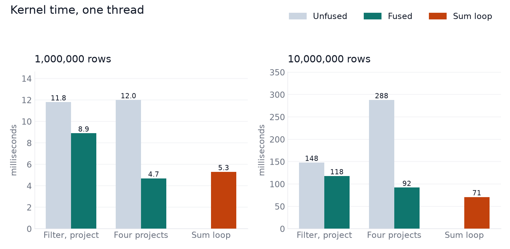
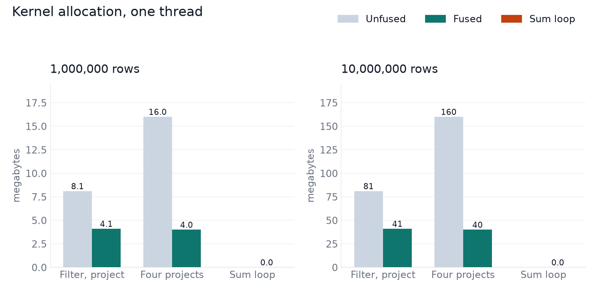
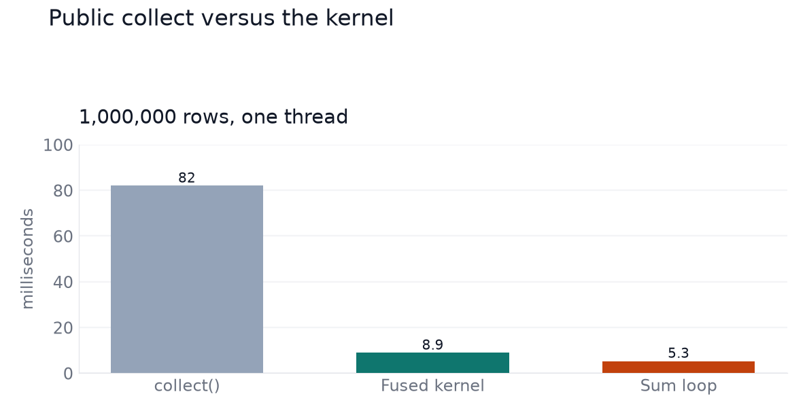
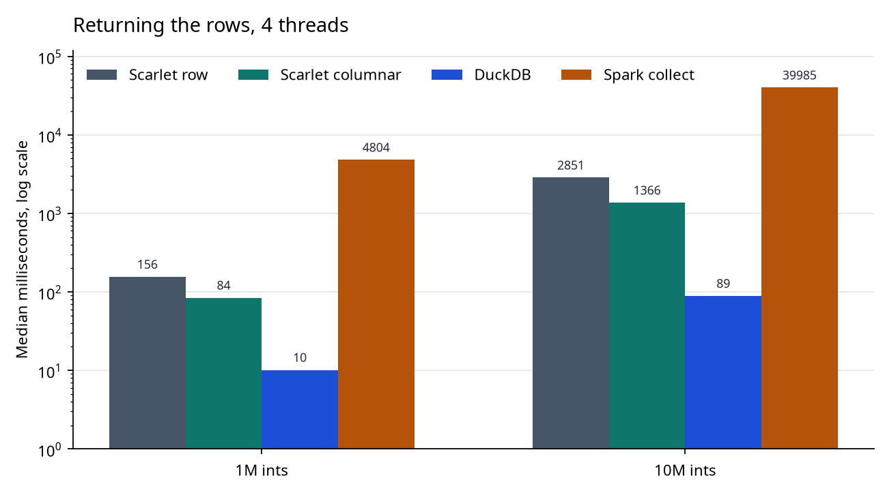
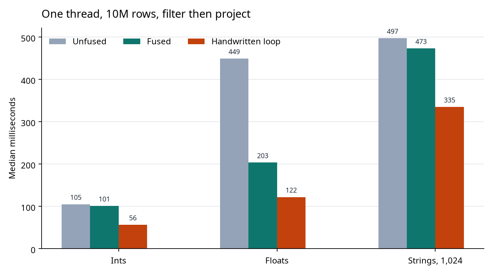
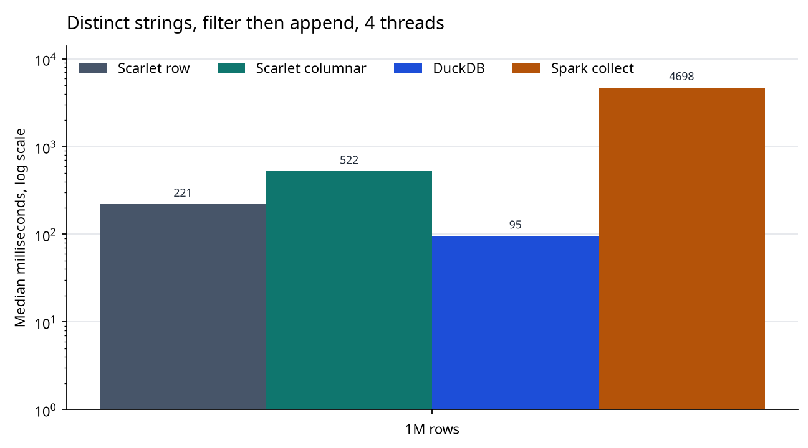

Vectorization is simply the process of running a single instruction over a column of values, typically a few thousand values at a time. It's used by ClickHouse, DuckDB, Numpy, Datafusion, and most others modern fast engines. 

This is in contract to how most data processing engines work: relational databases like PostgresDB, and even Apache Spark, all use a row-based execution model. For modern analytical engines thoguh, vectorization has become the standard due to its much better performance with filters, aggregations, and other operations on large columns of data. 

Contrary to popular belief, vectorization works in any language; it doesn't need a native language like C++ or Rust. In fact, this post builds the entire engine in pure Scala (and we'll use JVM dialect for convenience, but same principles apply in general).

---

## Row-based Execution

Let's start with a basic query operation, using a Spark-style syntax in Scala: 
```scala
values.filter(_ > 0).map(_ * 2).collect()
```
A simple row engine runs the filter, then the multiply, on each int, one at a time. It allocates one object for the filter function and one for the map function, then calls each once per element through an iterator:

```scala
def filter[A](predicate: A => Boolean): Stage[A, A] = {
  SingleOpStage { p =>
    val it = p.data.iterator.filter(predicate)
    Partition(IterUtil.iterableOf(it))
  }
}

def map[A, B](f: A => B): Stage[A, B] = {
  SingleOpStage { p =>
    val it = p.data.iterator.map(f)
    Partition(IterUtil.iterableOf(it))
  }
}
```
Critically, the data is not physically located together, further slowing down processing. Since each int is its own object, the next value is a pointer chase away rather than at the adjacent 4 bytes. A contiguous array of bytes could stream directly from cache to CPU, but that's impossible here.

The engine may also need to pay the cost type conversions, or "boxing" in the JVM, which is converting from the `java.lang.Integer` to a raw 4-byte int before doing the comparison, then boxing the result after the map from raw int back into `java.lang.Integer`. This is true to some extent for all high-level languages like Scala.

Due to both 1-by-1 processing and boxing, processing that 1 million element list is pretty slow! On my Core i7 machine, this took xx ms in vanilla Scala. The row engine's `collect` of the same query took about 195 ms and allocated about 84 MB, on 4 threads. A million raw ints are 4 MB, so that is about 20× the data.

(will make into nicer mermaid or image.)
```
List[Int], already in memory

:: ──► :: ──► :: ──► nil
│      │      │
Integer Integer Integer
┌────┐ ┌────┐ ┌────┐
│ 12 │ │ -4 │ │  7 │
└────┘ └────┘ └────┘
  × 1,000,000 of each

one element of xs.filter(_ > 0)

load next cell     tail
load head          the Integer
     │
     ▼
unboxToInt
checkcast Integer
load the int field
     │
     ▼
compare > 0
     │
     ├─ false: drop it. no new Integer, no new ::
     │
     ▼ true
keep that same Integer
no Integer.valueOf
     │
     ▼
new ::
allocate a cons cell
point it at that same Integer
link it to the previous survivor

one element of xs.map(_ * 2)

load next cell     tail
load head          the Integer
     │
     ▼
unboxToInt
checkcast Integer
load the int field
     │
     ▼
imul 2
the whole arithmetic
     │
     ▼
Integer.valueOf
allocate a new Integer
store the int in it
     │
     ▼
new ::
allocate a cons cell
point it at that Integer
link it to the previous cell
```

## Vectorization

The key principle to understand for vectorization is that of contiguous data. When the engine sets the data to be processed as an entire column (or vector) at once, the next value is always 4 bytes away from the current value.

The column is stored in a contiguous location of memory addresses: in our case the 1 million ints take 4MB of contiguous addresses.

When the CPU starts processing the data in the column, it knows that the next value is always 4 bytes ahead of the current one. Therefore, it pulls an entire chunk of data, 64 bytes or 16 ints, from memory into L1 cache, before the CPU processing loop even asks for it. Then the CPU always has the next value available in L1, whereas in the row-based approach, the CPU needs to read the pointer then pull the next value from memory, for every single value.

Recall the standard data storage setup for a CPU:
1. **CPU register**: directly on the CPU, accessible in 1 CPU clock cycle, for bytes being processed
2. **L1 cache**: 32KB, accessible in 1-2 clock cycles
3. **L2 cache**: 256KB, accessible in 10-15 clock cycles
4. **L3 cache**: 8MB, accessible in ~20-40 clock cycles
5. **Memory (RAM)**: 12GB, accessible in ~100-400 clock cycles

(Size values here are for an 8th-gen i7.)

In the case of example, with the processed data always being ready and waiting in L1 cache, the CPU is fully saturated and speeds through the 1 million ints for the filter step, writing the filter result back to memory. Then it speeds through the map step as well.

The row-based engine needs 2 million total data fetches for both filter and map across the 1 million values. The vectorized approach's bottleneck can be modeled as the 2 million L3 -> L1 fetches and 2 million CPU -> L1 cache fetches, under the assumption that data is always pre-fetched into cache and the CPU is never idle.

Conservatively, with 20 clock cycles per L3 fetch and 100 per RAM fetch, the vectorized operation is 50x faster. From my tests with Scala, this is approximately correct, with the row-based taking xx ms versus xx ms for vectorized.

### Code

```scala
// excerpt showing simplified setup of vectorized processing, from Scarlet

````

[benchmark numbers]

## Fused Operations

In the previous example, the engine still executes two CPU instructions per value, so each value leaves the CPU. The data gets pulled from memory to L3 to L1 to CPU for the first filter, only to be pushed back to L3 then L1 then CPU again for the mutiply. With data movement being the bottleneck, the overall query is limited by moving values between cache levels up to 2 million times, for only 1 million values.

This can be optimized one level up, in the planning stage, by fusing the CPU operations into a single kernel instead. The CPU can run both the filter and the multiply step while the data is still in the register, so there is no intermediate array and no data movement.

Note that fusing is separate from vectorization, and it's been a common operation in query engines for a long time, including in Spark. With vectorization and fusing together though, for large column-heavy workloads, engines see massive performance benefits.

### Code
In code, the query planning needs to be updated to recognize and combine these into a single operation (or stage, in typical query planning language).

```scala

````
[short explanation]
[benchmark numbers]


## SIMD

Vectorization might immediately bring up memories of SIMD, or Single Instruction Multiple Data. This is a form of vectorized parallel processing one level even deeper, within the CPU instructions themselves.

The core idea here is exactly as it sounds: a single CPU instruction literally running over multiple values in a single cycle. In this example, the operation `out[i] = in[i] * 2` becomes a single AVX2 instruction operating on 8 ints (32 bytes) at once. All 8 ints are loaded into adjacent lanes as a contiguous block, the CPU executes the bit shift operation for the multiply across all ints, then all 8 int results are stored in oine operation.

### Code

For Scala, in fact a plan `while` loop over an `Array[Int]` is automatically using SIMD on modern JVM compilers, such as [HotSpot](https://en.wikipedia.org/wiki/HotSpot).

You can also call for SIMD explicitly here, using `jdk.incubator.vector`. Here `SPECIES_256` represents 8 ints (256 bits) processed in parallel across lanes:

```scala
import jdk.incubator.vector.{IntVector, VectorOperators}

def explicitMul(in: Array[Int], out: Array[Int]): Unit =
  val species = IntVector.SPECIES_256
  val lanes = species.length()
  var i = 0
  val bound = species.loopBound(in.length)
  while i < bound do
    val v = IntVector.fromArray(species, in, i)
    v.lanewise(VectorOperators.LSHL, 1).intoArray(out, i)
    i += lanes
  while i < in.length do
    out(i) = in(i) * 2
    i += 1
```

On 1 million ints, with HotSpot's auto-vectorizer turned off, the plain `out(i) = in(i) * 2` loop took 0.60 ms. This 8-wide loop took 0.32 ms, for a ~1.8x speedup (data movement overheads prevent it from being a full 8x speedup.)

Note that the filter operation is not included here; since that drops some of the values, it's not as trivial as a simple map operation across the lanes. There do exist instruction sets that extend SIMD for these operations, such as Intel's AVX-512 as an extension to x86. This essentially works using masks ([Opmask registers](https://en.wikipedia.org/wiki/AVX-512#Opmask_registers) to handle filtered values, and pushing the surviving values down to bottom lanes from which the results are stored. 

## On Languages

We wrote our examples here in Scala, rather than a lower-level language, to illustrate the point that vectorization itself is language agnostic. In fact, my entire for-fun processing engine project, [Scarlet](https://github.com/ewoodbury/scarlet), is in Scala yet still beats Apache Spark easily thanks in large part due to vectorization.

That being said, low-level systems languages provide the advantage of more direct memory control, specifically in being able to avoid the boxing and unboxing conversion cost of values. Spark and JVM languages can reach the same speed within the CPU loops, but pay the boxing tax at the beginning and end of the operation when converting to and from raw bytes.

[some more details]


Notes 

2026-10-03, `opt/physical-fusion` `a467193`. i7-8550U, powersave. 1e6 about 2.3 GHz median. 1e7 about 1.8 GHz median. One thread unless noted. Checksums `500354792612` and `4994678901194`.



### 1,000,000 rows

Median milliseconds. Min and p90 in parentheses. Allocation is the mean.

| | Unfused | Fused |
| --- | --- | --- |
| Filter `v > 0`, project `* 2` | 11.8 (8.4–18.1), 8.1 MB | 8.9 (8.9–8.9), 4.1 MB |
| Four `+ 1` projects | 12.0 (12.0–12.3), 16.0 MB | 4.7 (4.3–7.0), 4.0 MB |
| Sum loop | | 5.3 (5.2–7.3) |

October 2, about 2.0 GHz median: unfused filter-project 11.6 ms, sum loop 6.4 ms. Four projects on the earlier kernel log: 15.5 ms, 16 MB. One project on that log: 4.0 ms, 4 MB.



### 10,000,000 rows

| | Unfused | Fused |
| --- | --- | --- |
| Filter, project | 148 (130–402), 81 MB | 118 (113–125), 41 MB |
| Four projects | 288 (217–377), 160 MB | 92 (89–99), 40 MB |
| Sum loop | | 71 (67–74) |

October 2: unfused filter-project 110 ms, sum loop 54 ms.



### collect

`filter(_ > 0).map(_ * 2)`.

| | October 2 | 2026-10-03 |
| --- | ---: | ---: |
| 1 thread | 78 ms | 82 ms, 45 MB |
| 4 threads | 76 ms | 72 ms |

The tables above are the earlier fusion draft, `a467193`, a different clock. The sitting below is `a8f09a2` on the evening of 2026-10-03. Full grid, min, p90, and the clocks are in `notes/sparklet/vectorization-sitting-2026-10-03.md`.

## This sitting

Filter `v > 0`, then `* 2`, 4 threads. Scarlet row and Scarlet columnar are `collect()`. DuckDB is `CREATE TABLE`. Spark is `collect()` onto the driver. Median milliseconds. The 1M columnar sample sat at 1.10 GHz and the 1M DuckDB sample at 0.90 GHz. At 10M, Scarlet was about 2.15 GHz and DuckDB about 2.00 GHz.



| | Scarlet row | Scarlet columnar | DuckDB | Spark collect |
| --- | ---: | ---: | ---: | ---: |
| 1M ints | 156 ms, 84 MB | 84 ms, 41 MB | 10 ms | 4804 ms |
| 10M ints | 2851 ms, 835 MB | 1366 ms, 407 MB | 89 ms | 39985 ms |

The same 10M int filter as a sum, 4 threads: DuckDB 22 ms, Spark 163 ms. The one-thread fused Scarlet kernel was 101 ms. The handwritten loop was 56 ms.



Distinct strings, 1M rows, same filter shape, 4 threads. The row collect is faster than the columnar collect.



| | Scarlet row | Scarlet columnar | DuckDB | Spark collect |
| --- | ---: | ---: | ---: | ---: |
| Distinct, 1M | 221 ms, 100 MB | 522 ms, 168 MB | 95 ms | 4698 ms |

A full Spark collect of 10M strings was OOM-killed. The 1,024-group filter collect at 1 thread did finish: 40.1 s. The other 10M string collects returned lengths only.
